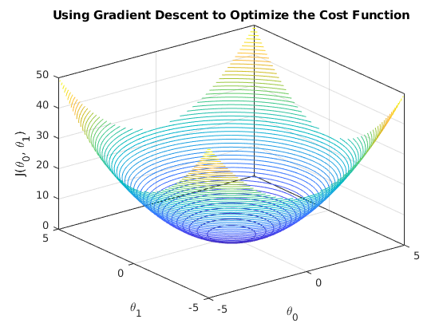

This is [Lecture 2](https://www.youtube.com/watch?v=4b4MUYve_U8&list=PLoROMvodv4rMiGQp3WXShtMGgzqpfVfbU&index=2) of the Stanford CS229 course.

We go through
- Linear regression
- Batch vs stochastic gradient descent
- Normal equation

# Linear Regression

We have a dataset of the size of a house, and its price

| Size (feet^2) | Number of bedrooms | Price |
| ------------- | ------------------ | ----- |
| 2104          | 3                  | 400   |
| 1416          | 2                  | 232   |
| 1534          | 3                  | 315   |

We want to find an algorithm to predict: Based on the size of the house, what is the price of the house? We basically want to find $h(x)$ such that:

$$
h_{\theta}(x) = \theta_0 + \theta_1 x_1 + \theta_2 x_2
$$
- where $x_1$ is the size of the house, and $x_2$ is the number of bedrooms

In a general linear regression problem, we want to find

$$
y = h_{\theta}(x) = \sum_{j = 0}^{D} \theta_j x_j = \mathbf{\theta}^{\intercal} \mathbf{x}
$$
- where $D$ is the number of features (dimensionality)
- $\mathbf{\theta} = \begin{pmatrix} \theta_0 \\ \vdots \\ \theta_D \end{pmatrix} \in \mathbb{R}^{D + 1}$ is the parameter we want to find using linear regression
- $\mathbf{x} = \begin{pmatrix} 1 \\ x_1 \\ \vdots \\ x_D \end{pmatrix} \in \mathbb{R}^{D + 1}$ are the input/features we have
- $y$ is the output/target we want to predict

How do we find $\mathbf{\theta}$?
- We want to choose $\mathbf{\theta}$ such that $h_{\theta}(x) \approx y$
- We can quantify the error of our predictions using an **error function**. For linear regression, the error function is the least-squares error, which is defined as:

$$
J(\mathbf{\theta}) = \frac{1}{2} \sum_{i = 1}^{N} \left( h_{\theta} \left( \mathbb{x}^{(i)} \right) - y^{(i)} \right)^2
$$
- We want to find $\mathbf{\theta}$ such that $J(\mathbf{\theta})$ is minimised

$$
\argmin_{\mathbf{\theta}} J(\mathbf{\theta})
$$
- We take this algorithm for granted for now, explained in the next lecture why we use least-squares
- To find the value of $\mathbf{\theta}$ such that we can minimise the error function, we can use **gradient descent**.

# Gradient Descent

We want to choose $\mathbf{\theta}$ so as to minimise $J(\mathbf{\theta})$.

1. We start with some initial guess for $\mathbf{\theta}$ (e.g. $\mathbf{\theta} = \vec{0}$)
2. We keep changing $\mathbf{\theta}$ to reduce $J(\mathbf{\theta})$. We want to move towards the values which minimise $J(\mathbf{\theta})$ as quickly as possible.
3. We hope to converge on a value of $\mathbf{\theta}$ that minimises $J(\mathbf{\theta})$.

> Note: In gradient descent, it is possible that we end up in a local minima instead of a global minima. However, for linear regression, it is guaranteed that we will only end up in a global minima. Explained later.

Formally:

$$
\mathbf{\theta}_j \coloneqq \mathbf{\theta}_j - \alpha \frac{\partial}{\partial \theta_j} J(\mathbf{\theta})
$$
- $\coloneqq$ refers to assignment. E.g. $a \coloneqq a + 1$
- For the $j$-th feature (where $j = 0, 1, ..., D$), we update $\mathbf{\theta}_j$ based on the formula above.
- $\alpha$ is the **learning rate** of our algorithm, which is how big of a step we take in the direction towards the minima.

Let's calculate how to update the parameter $\mathbf{\theta}$ with 1 training example (so we can ignore the sum):

$$
\begin{align*}
    \frac{\partial}{\partial \mathbf{\theta}_j} J(\mathbf{\theta}) &= \frac{\partial}{\partial \mathbf{\theta}_j} \frac{1}{2} \left( h_{\theta} \left( \mathbb{x}^{(i)} \right) - y^{(i)} \right)^2 \\
    &= \left( h_\mathbf{\theta}(\mathbf{x}) - y \right) \left( \frac{\partial}{\partial \mathbf{\theta}_j} h_\mathbf{\theta}(\mathbf{x}) - y \right) \\
    &= \left( h_\mathbf{\theta}(\mathbf{x}) - y \right) \left( \frac{\partial}{\partial \mathbf{\theta}_j} \sum_{i = 0}^{D} \theta_i x_i - y \right) \\
    &= \left( h_\mathbf{\theta}(\mathbf{x}) - y \right) \left( x_j \right)
\end{align*}
$$

So, for a single training example, we have the update rule, and we repeat this until convergence:

$$
\mathbf{\theta}_j \coloneqq \mathbf{\theta}_j + \alpha \left( y^{(i)} - h_\mathbf{\theta} \left( \mathbf{x}^{(i)} \right) \right) x_j^{(i)}
$$
- This is called the **least mean squares** (LMS) update rule, also known as the **Widrow-Hoff** learning rule.
- The magnitude of the update is proportional to the error term $y^{(i)} - h_\mathbf{\theta} \left( \mathbf{x}^{(i)} \right)$. If our error is small, we should have a minimal update, but if our error is large, we should have a larger update.

For a training set with $N$ examples, we can update $\mathbf{\theta}_j$ by adding up the errors from all the training examples:

$$
\forall j, \ \mathbf{\theta}_j \coloneqq \mathbf{\theta}_j + \alpha \sum_{i = 1}^{N} \left( y^{(i)} - h_\mathbf{\theta} \left( \mathbf{x}^{(i)} \right) \right) x_j^{(i)}
$$

We can compact this equation by writing it in terms of $\mathbf{\theta}$:

$$
\mathbf{\theta} \coloneqq \mathbf{\theta} - \alpha \nabla_\mathbf{\theta} J(\theta) = \mathbf{\theta} + \alpha \sum_{i = 1}^{N} \left( y^{(i)} - h_\mathbf{\theta} \left( \mathbf{x}^{(i)} \right) \right) x^{(i)}
$$
- $\mathbf{\theta} \in \mathbb{R}^{D + 1}$ is the parameters we are trying to find to minimise $J(\mathbf{\theta})$.
- $\alpha \in \mathbb{R}$ is the learning rate of the algorithm.
- $\nabla_\mathbf{\theta} J(\theta)$ is the gradient of the error function.
- $\mathbb{x}^{(i)} \in \mathbb{R}^{D + 1}$ is the $i$-th training example.
- $y^{(i)} \in \mathbb{R}$ is the target for the $i$-th training example.
- $h_\mathbf{\theta} \left( \mathbb{x}^{(i)} \right) = \mathbf{\theta}^{\intercal} \mathbf{x} \in \mathbb{R}$ is our predicted value for the $i$-th training example

> Note: For linear regression, using least mean squares error is guaranteed to hit a global minima, because linear regression's error function is quadratic. 

# Choosing $\alpha$

We want to choose an appropriate value for $\alpha$. 
- If $\alpha$ is too low, it might take too long to converge to the global minima.
- If $\alpha$ is too high, we might not be able to converge to the global minima.

In practice, we usually set $\alpha = 0.01$, and then experiment with a few values, e.g. $\alpha \in \{ 0.001, 0.01, 0.1 \}$

# Batch/Stochastic Gradient Descent

In batch gradient descent, we look at the entire dataset, calculate $J(\mathbf{\theta})$, and then update the weights. 

1. We have a dataset $\{ (\mathbf{x}^{(1)}, y^{(1)}), (\mathbf{x}^{(2)}, y^{(2)}), ..., (\mathbf{x}^{(N)}, y^{(N)}) \}$ of $N$ examples.
2. For every iteration, we look through all the examples from $1$ to $N$.
3. Loop until convergence:
   1. We update $\mathbf{\theta}$ based on the update rule we saw previously:
   $$
   \mathbf{\theta} \coloneqq \mathbf{\theta} + \alpha \sum_{i = 1}^{N} \left( y^{(i)} - h_\mathbf{\theta} \left( \mathbf{x}^{(i)} \right) \right) x^{(i)}
   $$

For extremely large datasets, this may be extremely slow, because we have to calculate $\sum_{i = 1}^{N} \left( y^{(i)} - h_\mathbf{\theta} \left( \mathbf{x}^{(i)} \right) \right) x^{(i)}$.

There is an alternative called **stochastic gradient descent** (or **incremental gradient descent**), where instead of going through the entire dataset, and updating the parameters once per entire run of the dataset, we can update the parameters every example.

1. We have a dataset $\{ (\mathbf{x}^{(1)}, y^{(1)}), (\mathbf{x}^{(2)}, y^{(2)}), ..., (\mathbf{x}^{(N)}, y^{(N)}) \}$ of $N$ examples.
2. We loop until convergence:
   1. For each training example $i$ from $1$ to $N$, we have the inputs $\mathbf{x}^{(i)}$ and target $y^{(i)}$.
      1. We update $\mathbf{\theta}$ with the update rule:

      $$
       \mathbf{\theta} \coloneqq \mathbf{\theta} + \alpha \left( y^{(i)} - h_\mathbf{\theta} \left( \mathbf{x}^{(i)} \right) \right) x^{(i)}
      $$

Often, stochastic gradient descent gets $\mathbf{\theta}$ close to the minimum much faster than batch gradient descent. 
- However, it may never converge to the minimum, and the parameters $\mathbf{\theta}$ may keep oscillating around the minimum of $J(\mathbf{\theta})$. 
- However, in practice, most of the values near the minimum will be reasonably good approximations of the true minimum. 
- We can also slowly let the learning rate $\alpha$ decrease to zero, to ensure that the parameters converge to the global minimum, rather than merely oscillating around it.

# The Normal Equation

Specifically for linear regression, there is a way of explicitly minimising $J$ in a single step without resorting to the iterative gradient descent algorithm. In this method, we minimise $J$ by explicitly taking derivatives with respect to the $\theta_j$'s, and setting them to 0.

## Notation Definition: Matrix Derivatives

We have to define some notation first.

For a function $f: \mathbb{R}^{n \times d} \mapsto \mathbb{R}$ mapping from $n$-by-$d$ matrices to real numbers, we define the derivative of $f$ with respect to $A$ be:

$$
\nabla_A f(A) = \begin{bmatrix} 
    \frac{\partial f}{\partial A_{11}} & \cdots & \frac{\partial f}{\partial A_{1d}} \\
    \vdots & \ddots & \vdots \\
    \frac{\partial f}{\partial A_{n1}} & \cdots & \frac{\partial f}{\partial A_{nd}}
\end{bmatrix}
$$

Thus, the gradient $\nabla_A f(A)$ is itself an $n$-by-$d$ matrix, whose $(i, j)$-element is $\frac{\partial f}{\partial A_{ij}}$. 

For example, let $A = \begin{bmatrix} A_{11} & A_{12} \\ A_{21} & A_{22} \end{bmatrix}$, and $f: \mathbb{R}^{2 \times 2} \mapsto \mathbb{R}$ be given by:

$$
f(A) = \frac{3}{2} A_{11} + 5 A_{12}^2 + A_{21} A_{22}
$$

Then, 

$$
\nabla_A f(A) = \begin{bmatrix}
    \frac{3}{2} & 10A_{12} \\
    A_{22} & A_{21} \\
\end{bmatrix}
$$

## Derivation of the Normal Equation

We have a dataset $\{ (\mathbf{x}^{(1)}, y^{(1)}), (\mathbf{x}^{(2)}, y^{(2)}), ..., (\mathbf{x}^{(N)}, y^{(N)}) \}$ of $N$ examples. Let each training example $\mathbf{x}^{(i)}$ be a vector of $D$ dimensions (we are using $D$ instead of $D + 1$ for simplicity), and $y^{(i)}$ be the target.

Recall the definition of $J: \mathbb{R}^{D} \mapsto \mathbb{R}$, mapping a vector of $D$ dimensions into a single real number which represents our error.

$$
J(\mathbf{\theta}) = \frac{1}{2} \sum_{i = 1}^{N} \left( h_{\theta} \left( \mathbb{x}^{(i)} \right) - y^{(i)} \right)^2
$$

To find the minimum of $J(\mathbf{\theta})$, we want to find the gradient $\nabla_{\mathbf{\theta}} J(\mathbf{\theta})$. Before we find the gradient, let's express $J(\mathbf{\theta})$ a bit differently, by defining a few more variables.

We define the design matrix $\mathbf{X} \in \mathbb{R}^{N \times D}$, which contains the training examples' input values as its rows:

$$
\mathbf{X} = \begin{bmatrix}
 \text{---} & (x^{(1)})^{T} & \text{---} \\
 \text{---} & (x^{(2)})^{T} & \text{---} \\
  & \vdots &  \\
 \text{---} & (x^{(N)})^{T} & \text{---} \\
\end{bmatrix}
$$

We let $\vec{y} \in \mathbb{R}^N$ be the vector containing all the target values from the training set:

$$
\vec{y} = \begin{bmatrix}
    y^{(1)} \\
    y^{(2)} \\
    \vdots \\
    y^{(N)} \\
\end{bmatrix}
$$

Since $h_{\mathbf{\theta}}(\mathbf{x}^{(i)}) = \left(\mathbf{x}^{(i)}\right)^T \mathbf{\theta}$, then we can easily verify that:

$$
\begin{align*}
\mathbf{X}\mathbf{\theta} - \vec{y} &= \begin{bmatrix}
    (x^{(1)})^{T} \mathbf{\theta} \\
    \vdots  \\
    (x^{(N)})^{T} \mathbf{\theta} \\
\end{bmatrix} - \begin{bmatrix}
    y^{(1)} \\
    \vdots \\
    y^{(N)} \\
\end{bmatrix} \\
&= \begin{bmatrix}
    h_{\mathbf{\theta}}\left( x^{(1)} \right) - y^{(1)} \\
    \vdots \\
    h_{\mathbf{\theta}}\left( x^{(N)} \right) - y^{(N)} \\
\end{bmatrix}
\end{align*}
$$

Thus, using the fact that for a vector $z$, we have $z^T z = \sum_i z_i^2$: 

$$
\begin{align*}
\frac{1}{2} \left( \mathbf{X} \mathbf{\theta} - \vec{y} \right)^T  \left( \mathbf{X} \mathbf{\theta} - \vec{y} \right) &= \frac{1}{2} \sum_{i = 1}^{N} \left( h_{\theta} \left( \mathbb{x}^{(i)} \right) - y^{(i)} \right)^2 \\
&= J(\mathbf{\theta})
\end{align*}
$$

Finally, to minimize $J$, we find its derivatives with respect to $\mathbf{\theta}$:

$$
\begin{align*}
    \nabla_{\mathbf{\theta}} J(\mathbf{\theta}) &= \nabla_{\mathbf{\theta}} \frac{1}{2} \left( \mathbf{X} \mathbf{\theta} - \vec{y} \right)^T  \left( \mathbf{X} \mathbf{\theta} - \vec{y} \right) \\
    &= \frac{1}{2} \nabla_{\mathbf{\theta}} \left( (\mathbf{X} \mathbf{\theta})^T \mathbf{X} \mathbf{\theta} - (\mathbf{X} \mathbf{\theta})^T \vec{y} - \vec{y}^T (\mathbf{X} \mathbf{\theta}) + \vec{y}^T \vec{y} \right) \\
    &= \frac{1}{2} \nabla_{\mathbf{\theta}} \left( \mathbf{\theta}^T (\mathbf{X}^T \mathbf{X}) \mathbf{\theta} - \vec{y}^T (\mathbf{X} \mathbf{\theta}) - \vec{y}^T (\mathbf{X} \mathbf{\theta}) \right) \\
    &= \frac{1}{2} \nabla_{\mathbf{\theta}} \left( \mathbf{\theta}^T (\mathbf{X}^T \mathbf{X}) \mathbf{\theta} - 2(\mathbf{X}^T \vec{y})^T \mathbf{\theta} \right) \\
    &= \frac{1}{2} \left( 2 \mathbf{X}^T \mathbf{X} \mathbf{\theta} - 2 \mathbf{X}^T \vec{y} \right) \\
    &= \mathbf{X}^T \mathbf{X} \mathbf{\theta} - \mathbf{X}^T \vec{y}
\end{align*}
$$

- In step 3, we used a few facts
  - $(ab)^T = b^T a^T$, so that $(\mathbf{X} \mathbf{\theta})^T \mathbf{X} \mathbf{\theta} = \mathbf{\theta}^T (\mathbf{X}^T \mathbf{X}) \mathbf{\theta}$ .
  - $a^T b = b^T a$, so that $(\mathbf{X} \mathbf{\theta})^T \vec{y} = \vec{y}^T (\mathbf{X} \mathbf{\theta})$.
  - $\nabla_{\mathbf{\theta}} \vec{y}^T \vec{y} = 0$, since $\vec{y}$ does not depend on $\mathbf{\theta}$.
- In step 5, we used the facts 
  - $\nabla_x b^T x = b$, so that $\nabla_{\mathbf{\theta}} (\mathbf{X}^T \vec{y})^T \mathbf{\theta} = \mathbf{X}^T \vec{y}$.
  - $\nabla_x x^T A x = 2 Ax$ for a symmetric matrix $A$, so that $\nabla_{\mathbf{\theta}} \mathbf{\theta}^T (\mathbf{X}^T \mathbf{X}) \mathbf{\theta} = 2 \mathbf{X}^T \mathbf{X} \mathbf{\theta}$.

To minimise $J$, we set its derivatives to zero, and obtain the **normal equations**:

$$
\mathbf{X}^T \mathbf{X} \mathbf{\theta} = \mathbf{X}^T \vec{y}
$$

This, the value of $\mathbf{\theta}$ that minimises $J$ is given by the closed form equation:

$$
\theta = \left( \mathbf{X}^T \mathbf{X} \right)^{-1} \mathbf{X}^T \vec{y}
$$

> Note: We are implicitly assuming that $\mathbf{X}^T \mathbf{X}$ is invertible. If the number of linearly independent examples is fewer than the number of features, or if the features are not linearly independent, then $\mathbf{X}^T \mathbf{X}$ is not invertible. It is possible to fix the situation with additional techniques, which we will not discuss here.

# Summary

In general linear regression, we have a dataset $\{ (\mathbf{x}^{(1)}, y^{(1)}), (\mathbf{x}^{(2)}, y^{(2)}), ..., (\mathbf{x}^{(N)}, y^{(N)}) \}$
- $\mathbf{x}^{(i)} \in \mathbb{R}^D$ is our input, and $y^{(i)} \in \mathbb{R}$ is our target

We want to find $\mathbf{\theta} \in \mathbb{R}^D$ such that:
$$
y = h_{\theta}(x) = \sum_{j = 0}^{D} \theta_j x_j = \mathbf{\theta}^T \mathbf{x}
$$

We do that by minimising the cost function of **mean-squared error**:

$$
J(\mathbf{\theta}) = \frac{1}{2} \sum_{i = 1}^{N} \left( h_{\theta} \left( \mathbb{x}^{(i)} \right) - y^{(i)} \right)^2
$$

We can use gradient descent to iteratively converge towards the value of $\mathbf{\theta}$ that gives us our minimum error:

$$
\mathbf{\theta} \coloneqq \mathbf{\theta} - \alpha \nabla_\theta J(\mathbf{\theta})
$$

In batch gradient descent, we start with an initial guess for $\theta$, and then loop until convergence:

$$
\mathbf{\theta} \coloneqq \mathbf{\theta} + \alpha \sum_{i = 1}^{N} \left( y^{(i)} - h_\mathbf{\theta} \left( \mathbf{x}^{(i)} \right) \right) x^{(i)}
$$

In stochastic gradient descent, we loop until convergence:
 1. For each training example $i$ from $1$ to $N$, we have the inputs $\mathbf{x}^{(i)}$ and target $y^{(i)}$.
    1. We update $\mathbf{\theta}$ with the update rule:

    $$
     \mathbf{\theta} \coloneqq \mathbf{\theta} + \alpha \left( y^{(i)} - h_\mathbf{\theta} \left( \mathbf{x}^{(i)} \right) \right) x^{(i)}
    $$

For linear regression, we can directly find the value of $\theta$ that gives us the minimum error:

$$
\theta = \left( \mathbf{X}^T \mathbf{X} \right)^{-1} \mathbf{X}^T \vec{y}
$$

$$
    \mathbf{X} = \begin{bmatrix}
    \text{---} & (x^{(1)})^{T} & \text{---} \\
    \text{---} & (x^{(2)})^{T} & \text{---} \\
    & \vdots &  \\
    \text{---} & (x^{(N)})^{T} & \text{---} \\
    \end{bmatrix}, \quad \vec{y} = \begin{bmatrix}
        y^{(1)} \\
        y^{(2)} \\
        \vdots \\
        y^{(N)} \\
    \end{bmatrix}
$$

# Proofs Section

## $(AB)^T = B^T A^T$ for $A \in \mathbb{R}^{m \times n}$, $B \in \mathbb{R}^{n \times p}$

[Math stackexchange](https://math.stackexchange.com/questions/1440305/how-to-prove-abt-bt-at)

Let $A \in \mathbb{R}^{m \times n}$, $B \in \mathbb{R}^{n \times p}$

We denote $X_{ij}$ to be the element in the $i$-th row and the $j$-th column of matrix $X$.

We know that $(AB)_{ji} = (AB)^T_{ij}$, therefore:

$$
(AB)^T_{ij} = (AB)_{ji} = \sum_{k = 1}^{n} A_{jk} B_{ji}
$$

On the other hand:

$$
(B^T A^T)_{ij} = \sum_{k = 1}^{n} B^T_{ik} A^T_{kj} = \sum_{k = 1}^{n} B_{ki} A_{jk} =  \sum_{k = 1}^{n} A_{jk} B_{ki} 
$$

Since $(AB)^T_{ij} = (B^T A^T)_{ij}$ for all $i = 1, ..., p$ and $j = 1, ... m$, we have

$$
(AB)^T = B^T A^T
$$

## $a^T b = b^T a$ for $a, b \in \mathbb{R}^n$

Let $a = \begin{pmatrix} a_1 \\ \vdots \\ a_n \end{pmatrix}$, $b = \begin{pmatrix} b_1 \\ \vdots \\ b_n \end{pmatrix}$. Then 

$$
a^T b = \sum_{i = 1}^{n} a_i b_i
$$

And

$$
b^T a = \sum_{i = 1}^{n} b_i a_i = \sum_{i = 1}^{n} a_i b_i
$$

Therefore $a^T b = b^T a$.

## $z^T z = \sum_i z_i^2$ for $z \in \mathbb{R}^n$

Let $z = \begin{pmatrix} z_1 \\ \vdots \\ z_n \end{pmatrix}$

Then

$$
z^T z = \sum_{i = 1}^{n} z_i^2
$$

## $\nabla_x b^T x = b$

For some $x \in \mathbb{R}^n$, let $f(x) = b^Tx$ for some known vector $b \in \mathbb{R}^n$. Then:

$$
f(x) = \sum_{i = 1}^{n} b_i x_i
$$

So,

$$
\frac{\partial f(x)}{\partial x_k} = \frac{\partial}{\partial x_k} \sum_{i = 1}^{n} b_i x_i = b_k
$$

Therefore,

$$
\nabla_x b^T x = \begin{bmatrix}
    \frac{\partial b^T x}{\partial x_1} \\
    \vdots \\
    \frac{\partial b^T x}{\partial x_n}
\end{bmatrix} = \begin{bmatrix}
    b_1 \\
    \vdots \\
    b_n
\end{bmatrix} = b
$$

## $\nabla_x x^T A x = 2 Ax$ for a symmetric matrix $A \in \mathbb{S}^n$, $x \in \mathbb{R}^n$

Consider the quadratic function $f(x) = x^T A x$, for some $A \in \mathbb{S}^n$ (Symmetric $n$-by-$n$ matrix). Remember that:

$$
f(x) = \sum_{i = 1}^{n} \sum_{j = 1}^{n} A_{ij} x_i x_j
$$

To take the partial derivative with respect to $x_k$, we will consider the terms including $x_k$ and $x_k^2$ separately:

$$
\begin{align*}
    \frac{\partial f(x)}{\partial x_k} &= \frac{\partial f(x)}{\partial x_k} \sum_{i = 1}^{n} \sum_{j = 1}^{n} A_{ij} x_i x_j \\
    &= \frac{\partial f(x)}{\partial x_k} \left[ \sum_{i \neq k} \sum_{j \neq k} A_{ij} x_i x_j + \sum_{i \neq k} A_{ik} x_i x_k + \sum_{j \neq k} A_{kj} x_k x_j + A_{kk}x_k^2 \right] \\
    &= \sum_{i \neq k} A_{ik} x_i + \sum_{j \neq k} A_{kj} x_j + 2 A_{kk} x_k \\
    &= \sum_{i = 1}^{n} A_{ik} x_i + \sum_{j = 1}^{n} A_{kj} x_j \\
    &= 2 \sum_{i = 1}^{n} A_{ki} x_i
\end{align*}
$$
- In step 2, we split the sum into 4 parts
    1. $\sum_{i \neq k} \sum_{j \neq k} A_{ij} x_i x_j$ (Everything else)
    2. $\sum_{i \neq k} A_{ik} x_i x_k$ ($k$-th column except entry $k$)
    3. $\sum_{j \neq k} A_{kj} x_k x_j$ ($k$-th row except entry $k$)
    4. $A_{kk}x_k^2$ (The entry in the $(k, k)$ position)

$$
\begin{bmatrix}
A_{11} x_1 x_1 & A_{12} x_1 x_2 & \cdots & A_{1k} x_1 x_k & \cdots & A_{1n} x_1 x_n \\
A_{21} x_2 x_1 & A_{22} x_2 x_2 & \cdots & A_{2k} x_2 x_k & \cdots & A_{2n} x_2 x_n \\
\vdots &  & \ddots &  & & \vdots \\
A_{k1} x_k x_1 & A_{k2} x_k x_2 & \cdots & A_{kk} x_k x_k & \cdots & A_{kn} x_k x_n \\
\vdots & &  &  & \ddots & \vdots \\
A_{n1} x_n x_1 & A_{n2} x_n x_2 & \cdots & A_{nk} x_n x_k & \cdots & A_{nn} x_n x_n

\end{bmatrix}
$$

- In step 4, we move each $A_{kk} x_k$ back into the sums, one for each sum
- The last equality follows because $A$ is symmetric.

So,

$$
\nabla_x x^T A x = \begin{bmatrix}
    \frac{\partial f(x)}{\partial x_1} \\
    \vdots \\
    \frac{\partial f(x)}{\partial x_n} \\
\end{bmatrix} = \begin{bmatrix}
    2 \sum_{i = 1}^{n} A_{1i} x_i \\
    \vdots \\
    2 \sum_{i = 1}^{n} A_{ni} x_i \\
\end{bmatrix} = 2Ax
$$

Note that the $k$-th entry of $\nabla_x f(x)$ is just the inner product of the $k$-th row of $A$ and $x$. Therefore, $\nabla_x x^T A x = 2 Ax$. This is analogous to the single-variable calculus version that $\frac{\partial}{\partial x} ax^2 = 2ax$.

# Additional Resources

1. [Linear Regression, Clearly Explained](https://www.youtube.com/watch?v=7ArmBVF2dCs)