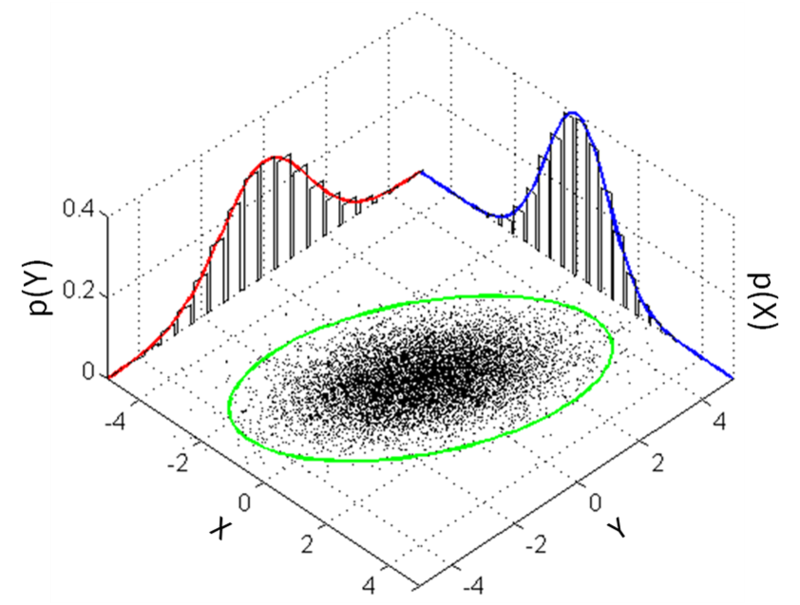

[Lecture 5](https://www.youtube.com/watch?v=nt63k3bfXS0&list=PLoROMvodv4rMiGQp3WXShtMGgzqpfVfbU&index=5)

# Discriminative vs. Generative Models

- Discriminative: Models $P(y | x; \theta)$
- Generative: Models $P(x | y)$ instead
  - For each class $k$, we try to learn what features make up class $k$

After a generative algorithm models $P(y)$ (class priors) and $P(x | y)$, then we can use Bayes rule to derive the posterior distribution of $y$ given $x$:

$$
P(y | x) = \frac{P(x | y) P(y)}{P(x)}
$$
- Note: $P(x) = P(x | y = 1) P(y = 1) + P(x | y = 0) P(y = 0)$

When trying to make a prediction, we do not actually have to calculate the denominator, because:

$$
\argmax_y P(y | x) = \argmax_y \frac{P(x | y) P(y)}{P(x)} = \argmax_y P(x | y) P(y)
$$

# Multi-Variate Gaussian Distribution

The multi-variate Gaussian distribution in $n$-dimensions is parameterised by a **mean vector** $\mu \in \mathbb{R}^n$ and a **covariance matrix** $\Sigma \in \mathbb{R}^{n \times n}$, where $\Sigma \geq 0$ is symmetric and positive semi-definite.

For the random variable $Z \in \mathbb{R}^n$ that is normally distributed:

$$
Z \sim \mathcal{N}(\mu, \Sigma)
$$

The probability density function of $Z$:

$$
P(Z; \mu, \Sigma) = \frac{1}{(2 \pi)^{n / 2} | \Sigma |^{1 / 2}} \exp \left( -\frac{1}{2} (x - \mu)^T \Sigma^{-1} (x - \mu) \right)
$$
- $|\Sigma|$ denotes the determinant of $\Sigma$.

We also have the expected value:

$$
E[Z] = \int_x x P(x; \mu, \Sigma) dx = \mu 
$$

and the covariance:

$$
\text{Cov}(Z) = \text{E}[(Z - \text{E}[Z])(Z - \text{E}[Z])^T] = \text{E}[ZZ^T] - \text{E}[Z]\text{E}[Z]^T = \Sigma
$$

The **standard gaussian** is when $\mu = \vec{0}$ and $\Sigma = I$.

# Gaussian Discriminant Analysis (GDA)

GDA is used for a classification problem, in which the input features $\mathbf{x} \in \mathbb{R}^d$ are continuous-valued random variables. GDA models $P(\mathbf{x} | y)$ using a multivariate normal distribution. The model is:

$$
\begin{align*}
    y &\sim \text{Bernoulli}(\phi) \\
    \mathbf{x} | y = 0 &\sim \mathcal{N}(\mu_0, \Sigma) \\
    \mathbf{x} | y = 1 &\sim \mathcal{N}(\mu_1, \Sigma)
\end{align*}
$$

The distributions are:

$$
\begin{align*}
    P(y) &= \phi^y (1 - \phi)^{1 - y} \\
    P(\mathbf{x} | y = 0) &= \frac{1}{(2\pi)^{d/2}|\Sigma|^{1/2}} \exp \left( -\frac{1}{2} (\mathbf{x} - \mu_0) \Sigma^{-1} (\mathbf{x} - \mu_0)\right) \\
    P(\mathbf{x} | y = 1) &= \frac{1}{(2\pi)^{d/2}|\Sigma|^{1/2}} \exp \left( -\frac{1}{2} (\mathbf{x} - \mu_1) \Sigma^{-1} (\mathbf{x} - \mu_1)\right) \\
\end{align*}
$$

There are 4 parameters of our model:
1. $\phi \in \mathbb{R}$: The prior probability that $y = 1$: $P(y = 1) = \phi$ (how likely each class label is **before** (prior to) seeing any input data $\mathbf{x}$).
2. $\Sigma \in \mathbb{R}^{d \times d}$: The shared covariance matrix used for both classes. This is how the features in $\mathbf{x} \in \mathbb{R}^n$ vary together.
    - $\Sigma_{ii}$: The variance of feature $i$: How much it spreads out.
    - $\Sigma_{ij}$: The covariance between features $i$ and $j$
      - $\Sigma_{ij} > 0$: When $\mathbf{x}_i$ is high, $\mathbf{x}_j$ tends to be high.
      - $\Sigma_{ij} < 0$: When $\mathbf{x}_i$ is high, $\mathbf{x}_j$ tends to be low.
      - $\Sigma_{ij} = 0$: $\mathbf{x}_i$ and $\mathbf{x}_j$ are uncorrelated.
3. $\mu_0 \in \mathbb{R}^{d}$: The mean vector of the Gaussian distribution for class 0.
4. $\mu_1 \in \mathbb{R}^{d}$: The mean vector of the Gaussian distribution for class 1.

We have a training set: $\{(\mathbf{x}^{(i)}, y^{(i)})\}_{i = 1}^{n}$. The **joint likelihood** of the data:

$$
\mathcal{L}(\phi, \mu_0, \mu_1, \Sigma) = \prod_{i = 1}^{n} P(\mathbf{x}^{(i)}, y^{(i)}; \phi, \mu_0, \mu_1, \Sigma) \\
= \prod_{i = 1}^{n} P(\mathbf{x}^{(i)} | y^{(i)}; \phi, \mu_0, \mu_1, \Sigma) P(y^{(i)}; \phi)
$$

> Note: In discriminative models, we were maximising the **conditional likelihood**:
> 
> $$
> \mathcal{L}(\theta) = \prod_{i = 1}^n P(y^{(i)} | \mathbf{x}^{(i)}; \theta)
> $$
>
> While in generative models, we are maximising the **joint likelihood**:
>
> $$
> \mathcal{L}(\phi, \mu_0, \mu_1, \Sigma) = \prod_{i = 1}^{n} P(\mathbf{x}^{(i)}, y^{(i)}; \phi, \mu_0, \mu_1, \Sigma)
> $$

Now we use maximium likelihood estimation:

$$
\argmax_{\phi, \mu_0, \mu_1, \Sigma} \mathcal{l}(\phi, \mu_0, \mu_1, \Sigma)
$$
- where $\mathcal{l}(\phi, \mu_0, \mu_1, \Sigma) = \log \mathcal{L}(\phi, \mu_0, \mu_1, \Sigma)$

THX TODO: Derivation

We get:
$$
\begin{align*}
    \phi &= \frac{1}{n} \sum_{i = 1}^{n} 1\{y^{(i)} = 1\} \\
    \mu_0 &= \frac{\sum_{i = 1}^{n} 1\{ y^{(i)} = 0\} \mathbf{x}^{(i)}}{\sum_{i = 1}^{n} 1\{y^{(i)} = 0\}} \\
    \mu_1 &= \frac{\sum_{i = 1}^{n} 1\{ y^{(i)} = 1\} \mathbf{x}^{(i)}}{\sum_{i = 1}^{n} 1\{y^{(i)} = 1\}} \\
    \Sigma &= \frac{1}{n} \sum_{i = 1}^n (\mathbf{x}^{(i)} - \mu_{y^{(i)}})(\mathbf{x}^{(i)} - \mu_{y^{(i)}})^T
\end{align*}
$$
- Looking at $\mu_0$: The numerator is the sum of feature vectors for examples with $y = 0$, and the denominator is just the number of examples with $y = 0$. This is similar for $\mu_1$.

- The circles are what GDA is trying to achieve, and the line is the decision boundary between $y = 0$ and $y = 1$.

To make a prediction for some new input $\mathbf{x}$, we get:

$$
y^* = \argmax_y P(y | \mathbf{x}) = \argmax_y \frac{P(\mathbf{x} | y) P(y)}{P(\mathbf{x})} = \argmax_y P(\mathbf{x} | y) P(y)
$$

## When is GDA better than Logistic Regression?

THX TODO clarify

GDA assumes that:

$$
\begin{align*}
    y &\sim \text{Bernoulli}(\phi) \\
    \mathbf{x} | y = 0 &\sim \mathcal{N}(\mu_0, \Sigma) \\
    \mathbf{x} | y = 1 &\sim \mathcal{N}(\mu_1, \Sigma)
\end{align*}
$$

If these assumptions are wrong, then logistic regression will do better (because logistic regression does not make these assumptions). But if the assumptions are correct, then GDA does better.

Logistic regression assumes that:

$$
P(y = 1 | x) = \frac{1}{1 + e^{-\theta x}}
$$

# Naive Bayes

For email spam classification:
1. We make a list of all english words. Let there be $d$ words.
2. We want to represent the email as a feature vector $\mathbf{x}$. We take the email and turn it in to a binary feature vector, where $\mathbf{x}_i = 1$ if the word is in the email, 0 otherwise. So $\mathbf{x} \in \{0, 1\}^d$.
3. We want to model $P(\mathbf{x} | y)$ and $P(y)$. There are $2^d$ possible values of $\mathbf{x}$, which means that if we were to model $\mathbf{x}$ explicitly with a multinomial distribution, we need $2^d - 1$ parameters, which is infeasible.
4. Assume that $\mathbf{x}_i$'s are conditionally independent given $y$ (Conditional independence assumption):

    $$
        P(\mathbf{x}_1, ..., \mathbf{x}_d | y) = P(\mathbf{x}_1 | y) P(\mathbf{x}_2 | y) \cdots P(\mathbf{x}_d | y) = \prod_{i = 1}^d P(\mathbf{x}_i | y)
    $$

The parameters of the model:

$$
\begin{align*}
\phi_{j | y = 1} &= P(\mathbf{x}_{j = 1} | y = 1) \\
\phi_{j | y = 0} &= P(\mathbf{x}_{j = 1} | y = 0) \\
\phi_y &= P(y = 1)
\end{align*}
$$
- $\phi_{j | y = 1}$: Given that the email is spam $y = 1$, what is the probability of word $j$ appearing?
- $\phi_{j | y = 0}$: Given that the email is not spam $y = 0$, what is the probability of word $j$ appearing?
- $\phi_y$: What is the probability that an email is spam?

We find the joint likelihood:

$$
\mathcal{L}(\phi_y, \phi_{j | y = 0}, \phi_{j | y = 1}) = \prod_{i = 1}^n P(\mathbf{x}^{(i)}, y^{(i)})
$$

By MLE, we get:

$$
\begin{align*}
    \phi_y &= \frac{1}{n} \sum_{i = 1}^n 1\{ y^{(i)} = 1 \} \\
    \phi_{j | y = 0} &= \frac{\sum_{i = 1}^n 1\{\mathbf{x}^{(i)}_j = 1, y^{(i)} = 0\}}{\sum_{i = 1}^n 1\{y^{(i)} = 0\}} \\
    \phi_{j | y = 1} &= \frac{\sum_{i = 1}^n 1\{\mathbf{x}^{(i)}_j = 1, y^{(i)} = 1\}}{\sum_{i = 1}^n 1\{y^{(i)} = 1\}}
\end{align*}
$$
- $\phi_y$: Probability that email is spam = (number of spam emails) / (total number of emails)
- $\phi_{j | y = 0}$: Probability that word $j$ appears in a non-spam email: (number of non-spam emails with word $j$) / (total number of non-spam emails)
- $\phi_{j | y = 1}$: Probability that word $j$ appears in a spam email: (number of spam emails with word $j$) / (total number of spam emails)

Then, to predict whether an email is spam:

$$
\begin{align*}
P(y = 1 | \mathbf{x}) &= \frac{P(\mathbf{x} | y = 1) P(y = 1)}{P(\mathbf{x})} \\
&= \frac{\left( \prod_{j = 1}^n P(\mathbf{x}_j | y = 1) \right) P(y = 1)}{\left( \prod_{j = 1}^n P(\mathbf{x}_j | y = 0) \right) P(y = 0) + \left( \prod_{j = 1}^n P(\mathbf{x}_j | y = 1) \right) P(y = 1)}
\end{align*}
$$

and then pick the class with the higher posterior probability.

THX TODO laplace smoothing

