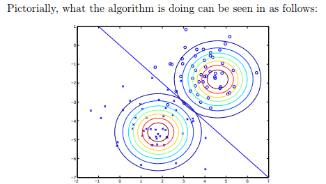

We go throught the Gaussian Discriminant Analysis (GDA) covered in [Lecture 5](https://www.youtube.com/watch?v=nt63k3bfXS0&list=PLoROMvodv4rMiGQp3WXShtMGgzqpfVfbU&index=5).

GDA is used for a classification problem, where your dataset is $\{(\mathbf{x}^{(i)}, y^{(i)})\}_{i=1}^n$, where $\mathbf{x}^{(i)} \in \mathbb{R}^d$, and $y \in \{0, ..., K - 1\}$. The goal is: Given a new $\mathbf{x}$, figure out which class $y$ it belongs to.

# What is GDA?

GDA is a generative machine learning algorithm for classification. 

In discriminative machine learning algorithm like logistic regression, we directly model $P(y \mid \mathbf{x})$, and compute the likeliest class for classification. However, a generative machine learning algorithm models:
1. The prior $P(y)$: How likely each class is before seeing any data.
2. The class-conditional density $P(\mathbf{x} \mid y)$: How the features are distributed for each class.

Then, we compute $P(y \mid \mathbf{x})$ using Bayes' theorem:

$$
P(y \mid \mathbf{x}) = \frac{P(\mathbf{x} \mid y) P(y)}{P(\mathbf{x})}
$$

# Model Assumptions

For GDA to be used, we make a few assumptions about the data we are working with:

## Assumption 1: Gaussian Class-Conditional Likelihood

We assume that the features within each class follows a multivariate normal distribution:

$$
\mathbf{x} \mid y = k \sim \mathcal{N}(\mu_k, \Sigma)
$$

- $\mu_k$ is the mean vector for class $k$ (the center of the Gaussian cloud for class $k$).
- $\Sigma$ is the **shared** covariance matrix across all classes. Sharing $\Sigma$ makes the decision boundaries linear. If each class had its own covariance $\Sigma_k$, we would have Quadratic Discriminant Analysis (QDA).

## Assumption 2: Class Priors

For binary classification,

$$
P(y = 1) = \phi, \quad P(y = 0) = 1 - \phi
$$

For multi-class classification:

$$
P(y = k) = \pi_k, \quad \sum_{i=0}^{K - 1} \pi_i = 1
$$

# Learning the Parameters: Maximum Likelihood Estimation

In this scenario, we shall look at a binary classification task. We have a dataset $\{(\mathbf{x}^{(i)}, y^{(i)})\}_{i=1}^n$, where:
- $\mathbf{x}^{(i)} \in \mathbb{R}^d$ is a $d$-dimensional feature vector.
- $y^{(i)} \in \{0, 1\}$ is our target. We have 2 classes here for binary classification.

We assume that our data follows the following distributions:
$$
\begin{align*}
    y &\sim \text{Bernoulli}(\phi) \\
    \mathbf{x} \mid y = 0 &\sim \mathcal{N}(\mu_0, \Sigma) \\
    \mathbf{x} \mid y = 1 &\sim \mathcal{N}(\mu_1, \Sigma)
\end{align*}
$$
1. The class labels $y$ follow a bernoulli distribution, where $\phi$ represents the probability of class $y = 1$ occurring.
2. The features $\mathbf{x}$ corresponding to class $y = 0$ follow a multivariate gaussian distribution with mean $\mu_0$ and covariance $\Sigma$.
3. The features $\mathbf{x}$ corresponding to class $y = 1$ follow a multivariate gaussian distribution with mean $\mu_1$ and covariance $\Sigma$.

> In GDA, we need a **covariance matrix** because our feature vector $\mathbf{x} \in \mathbb{R}^d$ is usually multi-dimensional, and the covariance matrix captures both
> 1. Variances of each feature (how spread out each dimension is).
> 2. Correlations between features (how changes in one dimension relate to changes in another dimension).
> 
> A single "standard variance" would throw away all the correlation information, and force the model to assume that all features are independent and have the same spread - which is almost never true in real data.

We can calculate the probability distributions of each of our variables:

$$
\begin{align*}
    P(y) &= \phi^y (1 - \phi)^{1 - y} \\
    P(\mathbf{x} \mid y = 0) &= \frac{1}{(2\pi)^{d/2}|\Sigma|^{1/2}} \exp \left( -\frac{1}{2} (\mathbf{x} - \mu_0)^T \Sigma^{-1} (\mathbf{x} - \mu_0)\right) \\
    P(\mathbf{x} \mid y = 1) &= \frac{1}{(2\pi)^{d/2}|\Sigma|^{1/2}} \exp \left( -\frac{1}{2} (\mathbf{x} - \mu_1)^T \Sigma^{-1} (\mathbf{x} - \mu_1)\right)
\end{align*}
$$

There are 4 parameters in our GDA model to learn:

1. $\phi \in \mathbb{R}$: The prior probability that $y = 1$ ($P(y = 1) = \phi$). 
   - This is how likely each class label is **before** (prior to) seeing any input data $\mathbf{x}$.
2. $\Sigma \in \mathbb{R}^{d \times d}$: The shared covariance matrix used for both classes. This is how the features in $\mathbf{x} \in \mathbb{R}^n$ vary together.
    - $\Sigma_{ii}$: The variance of feature $i$: How much it spreads out.
    - $\Sigma_{ij}$: The covariance between features $i$ and $j$
      - $\Sigma_{ij} > 0$: When $\mathbf{x}_i$ is high, $\mathbf{x}_j$ tends to be high.
      - $\Sigma_{ij} < 0$: When $\mathbf{x}_i$ is high, $\mathbf{x}_j$ tends to be low.
      - $\Sigma_{ij} = 0$: $\mathbf{x}_i$ and $\mathbf{x}_j$ are uncorrelated.
3. $\mu_0 \in \mathbb{R}^{d}$: The mean vector of the Gaussian distribution for class $0$.
4. $\mu_1 \in \mathbb{R}^{d}$: The mean vector of the Gaussian distribution for class $1$.

We have 4 parameters $\theta = \{ \phi, \mu_0, \mu_1, \Sigma \}$, and we want to find $\theta$ that **maximises the joint likelihood** of our data:

$$
\mathcal{L}(\theta) = \prod_{i = 1}^n P(\mathbf{x}^{(i)}, y^{(i)}; \theta)
$$

> In discriminative modelling, we maximise the **conditional likelihood** $P(y \mid \mathbf{x}; \theta)$, because we do not make any assumptions about the underlying distributions of the data $P(\mathbf{x})$, and focus only on modelling the decision boundary.
> 
> However in generative modelling, we maximise the **joint likelihood**, because we explicitly model how the data is generated - both $P(y)$ and $P(\mathbf{x} \mid y)$.
>
> A more detailed proof is explained at the end.

The parameters of $\phi, \mu_0, \mu_1, \Sigma$ that maximise the likelihood are:

$$
\begin{align*}
    \phi &= \frac{1}{n} \sum_{i = 1}^{n} 1\{y^{(i)} = 1\} \\
    \mu_0 &= \frac{\sum_{i = 1}^{n} 1\{ y^{(i)} = 0\} \mathbf{x}^{(i)}}{\sum_{i = 1}^{n} 1\{y^{(i)} = 0\}} \\
    \mu_1 &= \frac{\sum_{i = 1}^{n} 1\{ y^{(i)} = 1\} \mathbf{x}^{(i)}}{\sum_{i = 1}^{n} 1\{y^{(i)} = 1\}} \\
    \Sigma &= \frac{1}{n} \sum_{i = 1}^n (\mathbf{x}^{(i)} - \mu_{y^{(i)}})(\mathbf{x}^{(i)} - \mu_{y^{(i)}})^T
\end{align*}
$$

- $\phi$: The prior probability of $y = 1$. This is just (number of $y = 1$) / (total number of samples).
- $\mu_0$: The mean feature vector of all samples that correspond to $y = 0$. This is just (sum of all features where $y = 0$) / (number of samples where $y = 0$).
- $mu_1$: The mean feature vector of all samples that correspond to $y = 1$.
- $\Sigma$: The shared covariance matrix.
  - $\mu_{y^{(i)}}$ is the **mean vector** for the class that data point $i$ belongs to.
    - If $y^{(i)} = 0$, use $\mu_0$.
    - If $y^{(i)} = 1$, use $\mu_1$.
  - $\mathbf{x}^{(i)} - \mu_{y^{(i)}}$ is the deviation between the data point's features and the mean features of its class.
  - The outer product $(\mathbf{x}^{(i)} - \mu_{y^{(i)}})(\mathbf{x}^{(i)} - \mu_{y^{(i)}})^T$ creates a $d \times d$ matrix, which is the pairwise product of deviations for every feature pair.
    - The diagonal entries $\Sigma_{ii}$ capture the variance of each individual feature within the class (how much each feature varies).
    - The off-diagonal terms $\Sigma_{ij}$ capture the covariance between different features (how features vary together).
  - The we take the average with $\frac{1}{n} \sum_{i = 1}^n$

> Derivation of each term using MLE is given at the end.

This is how GDA classifies data points:

# How does GDA make Predictions?

We want to find $P(y = k \mid \mathbf{x})$. Using Bayes' theorem:

$$
P(y = k \mid \mathbf{x}) = \frac{P(\mathbf{x} \mid y = k) P(y = k)}{\sum_{j = 0}^{K - 1} P(\mathbf{x} \mid y = j) P(y = j)}
$$

We want to find the **posterior probability** $P(y = k \mid \mathbf{x})$: Given an input feature vector $\mathbf{x}$, what is the probability that this new feature belongs to class $k$?
- This is the quantity required for probabilistic classification - If $P(y = k \mid \mathbf{x})$ is the largest for some $k$, we predict that class. I.e.

    $$
        \hat{k} = \argmax_k P(y = k \mid \mathbf{x})
    $$

The numerator $P(\mathbf{x} \mid y = k) P(y = k)$ is a product of:
1. $P(y = k)$: The prior probability of class $k$.
    - This is how likely we think class $k$ is **before** seeing any features.
    - Example: If a dataset contains 90% cats and 10% dogs, then $P(y = \text{cat}) = 0.9$.
2. $P(\mathbf{x} \mid y = k)$: The likelihood (class-conditional probability)
    - This tells us: If the true class were $k$, how likely is it that we will see features $\mathbf{x}$?
    - In GDA, this is modelled by a Gaussian distribution $\mathcal{N}(\mu_k, \Sigma)$.
3. The product $P(\mathbf{x} \mid y = k) P(y = k)$ gives us the joint probability $P(\mathbf{x}, y = k)$: 
    - How likely it is to **both** be in class $k$ and see those features $\mathbf{x}$?

The denominator $\sum_{j = 0}^{K - 1} P(\mathbf{x} \mid y = j) P(y = j)$ is the total probability of seeing $\mathbf{x}$ regardless of class.
- We sum up over all possible classes $\{0, ..., K - 1\}$

    $$
        P(\mathbf{x}) = \sum_{j = 0}^{K - 1} P(\mathbf{x} \mid y = j) P(y = j)
    $$
- We divide by this, because we want $P(y = k \mid \mathbf{x})$ to be a true probability, so all classes' posteriors must sum to 1. The denominator here normalises the numerator.

You can think about it as:

$$
\text{Posterior} = \frac{\text{Likelihood} \times \text{Prior}}{\text{Evidence}}
$$
- **Prior**: What we believed about classes before seeing the data.
- **Likelihood**: How well class $k$ explains the data $\mathbf{x}$.
- **Evidence**: Overall probability of the data (normalising constant).
- **Posterior**: Updated belief about the class after seeing $\mathbf{x}$.

For example, we have a binary classification task of classifying cats vs dogs:
- $y \in \{\text{cat}, \text{dog}\}$
- Priors: $P(\text{cat}) = 0.9$, $P(\text{dog}) = 0.1$.
- Likelihood: $P(\mathbf{x} \mid \text{cat})$: How likely do the features $\mathbf{x}$ correspond to being a cat (and similarly for dog)?
- The posterior probability $P(\text{cat} \mid \mathbf{x})$ increases if:
    1. Cats are common in general (high prior).
    2. The features $\mathbf{x}$ are very typical for cats (high likelihood).

# Appendix

Additional elaborations and clarifications of certain topics.

## Discriminative Modelling vs. Generative Modelling

We have a dataset of $n$ IID samples:

$$
\{(\mathbf{x}^{(i)}, y^{(i)})\}_{i = 1}^n
$$

where $\mathbf{x}^{(i)} \in \mathbb{R}^d$ and $y^{(i)} \in \{0, ..., K - 1\}$.

When using a discriminative model (e.g. logistic regression), we maximise the **conditional likelihood**:

$$
\mathcal{L}_c(\theta) \coloneqq \prod_{i = 1}^n P(y^{(i)} \mid \mathbf{x}^{(i)}; \theta)
$$

However in generative models (e.g. GDA), we maximise the **joint likelihood**:

$$
\mathcal{L}(\theta) = \prod_{i=1}^n P(\mathbf{x}^{(i)} \mid y^{(i)}; \theta) P(y^{(i)}; \theta)
$$

Why?

### Discriminative Modelling: Model $P(y \mid \mathbf{x}; \theta)$

A discriminative model only specifies the conditional distribution $P(y \mid \mathbf{x}; \theta)$.
The distribution of $\mathbf{x}$, $P(\mathbf{x})$ is not modelled (or considered unknown).

Since the model does not specify $P(\mathbf{x})$, the likelihood of the full data cannot be written as a function of $\theta$ alone, because:

$$
P(\mathbf{x}^{(i)}, y^{(i)}; \theta) = P(y^{(i)} \mid \mathbf{x}^{(i)}; \theta) P(\mathbf{x}^{(i)})
$$

and $P(\mathbf{x}^{(i)})$ does not depend on $\theta$.

Thus, the joint likelihood over all samples is:

$$
\mathcal{L}(\theta) = \prod_{i = 1}^{n} P(\mathbf{x}^{(i)}, y^{(i)}; \theta) = \prod_{i = 1}^n P(y^{(i)} \mid \mathbf{x}^{(i)}; \theta) P(\mathbf{x}^{(i)})
$$

Since $P(\mathbf{x}^{(i)})$ is fixed (does not depend on $\theta$, and we are only finding $\theta$ that maximises this joint likelihood), maximising $\mathcal{L}(\theta)$ over $\theta$ is equivalent to maximising the conditional likelihood:

$$
\mathcal{L}_c(\theta) \coloneqq \prod_{i = 1}^n P(y^{(i)} \mid \mathbf{x}^{(i)}; \theta)
$$

$$
\hat{\theta} = \argmax_\theta \mathcal{L}(\theta) = \argmax_\theta \mathcal{L}_c(\theta) = \argmax_\theta \prod_{i = 1}^n P(y^{(i)} \mid \mathbf{x}^{(i)}; \theta)
$$

### Generative Model: Modelling $P(\mathbf{x}, y; \theta) = P(\mathbf{x} \mid y; \theta) P(y; \theta)$

In generative models, we explicitly specify both $P(y; \theta)$ and $P(\mathbf{x} \mid y; \theta)$. Hence, it fully specifies the joint distribution $P(\mathbf{x}, y; \theta)$.

Recall that $\theta = (\phi, \mu_0, \mu_1, \Sigma)$, and the probabilities:

$$
\begin{align*}
P(\mathbf{x} \mid y = k; \theta) &= \frac{1}{(2\pi)^{d/2}|\Sigma|^{1/2}} \exp \left( -\frac{1}{2} (\mathbf{x} - \mu_k)^T \Sigma^{-1} (\mathbf{x} - \mu_k)\right) \\
P(y; \theta) &= \phi^y (1 - \phi)^{1 - y}
\end{align*}
$$

The likelihood over the whole dataset is:

$$
\mathcal{L}(\theta) = \prod_{i=1}^n P(\mathbf{x}^{(i)}, y^{(i)}; \theta) = \prod_{i=1}^n P(\mathbf{x}^{(i)} \mid y^{(i)}; \theta) P(y^{(i)}; \theta)
$$

Every term depends fully on $\theta$, hence the natural MLE is:

$$
\hat{\theta} = \argmax_\theta \mathcal{L}(\theta) = \argmax_\theta \prod_{i=1}^n P(\mathbf{x}^{(i)} \mid y^{(i)}; \theta) P(y^{(i)}; \theta)
$$

## GDA vs Logistic Regression for Classification Problems

When should we use GDA, and when should we use logistic regression?

### When GDA outperforms Logistic Regression

1. Small sample sizes:
    - Because GDA models the full distribution $P(\mathbf{x}, y)$, it can leverage assumptions about how data is generated, leading to better parameter estimates with fewer training samples.
2. If model assumptions are approximately correct:
    - GDA assumes features within each class are Gaussian with shared covariance. If this matches reality well, it can provide more powerful, data-efficient classifications.

### When Logistic Regression outperforms GDA

1. Large sample sizes:
    - Logistic regression directly models the decision boundary $P(y \mid \mathbf{x})$ without assuming a specific feature distribution. With enough data, it can learn flexible boundaries, and often gets better classification accuracy.
2. Model mismatch:
    - If GDA's Gaussian assumptions are incorrect (e.g. features are not Gaussian, or covariance is not shared), then it will perform poorly, while logistic regression is more robust, since it doesn't make these assumptions.

In the paper "[On Discriminative vs. Generative classifiers: A comparison of logistic regression and Naive Bayes](https://ai.stanford.edu/~ang/papers/nips01-discriminativegenerative.pdf)" (Ng and Jordan (2002)), the paper showed that:
- Generative classifiers tend to have better asymptotic bias (perform better with fewer data).
- Discriminative classifiers tend to have better asymptotic variance (better with lots of data).

# Derivation for Parameters in GDA using MLE

We now use MLE to derive the different parameters for GDA.

We have a dataset $\{(\mathbf{x}^{(i)}, y^{(i)})\}_{i=1}^n$, where:
- $\mathbf{x}^{(i)} \in \mathbb{R}^d$ is a $d$-dimensional feature vector.
- $y^{(i)} \in \{0, 1\}$ is our target. We have 2 classes here for binary classification.

We assume that our data follows the following distributions:
$$
\begin{align*}
    y &\sim \text{Bernoulli}(\phi) \\
    \mathbf{x} \mid y = 0 &\sim \mathcal{N}(\mu_0, \Sigma) \\
    \mathbf{x} \mid y = 1 &\sim \mathcal{N}(\mu_1, \Sigma)
\end{align*}
$$

and our probability distributions are:
$$
\begin{align*}
    P(y) &= \phi^y (1 - \phi)^{1 - y} \\
    P(\mathbf{x} \mid y = 0) &= \frac{1}{(2\pi)^{d/2}|\Sigma|^{1/2}} \exp \left( -\frac{1}{2} (\mathbf{x} - \mu_0)^T \Sigma^{-1} (\mathbf{x} - \mu_0)\right) \\
    P(\mathbf{x} \mid y = 1) &= \frac{1}{(2\pi)^{d/2}|\Sigma|^{1/2}} \exp \left( -\frac{1}{2} (\mathbf{x} - \mu_1)^T \Sigma^{-1} (\mathbf{x} - \mu_1)\right)
\end{align*}
$$

Let $\theta = \{ \phi, \mu_0, \mu_1, \Sigma \}$ (our model parameters), and we want to find $\theta$ that **maximises the joint likelihood** of our data:

$$
\mathcal{L}(\theta) = \prod_{i = 1}^n P(\mathbf{x}^{(i)}, y^{(i)}; \theta)
$$

First, we find the log likelihood $\mathcal{l}(\theta)$:

$$
\begin{align*}
    \mathcal{l}(\theta) &= \log \mathcal{L}(\theta) \\
    &= \sum_{i = 1}^n \log P(\mathbf{x}^{(i)}, y^{(i)}; \theta)
\end{align*}
$$

Recall that by conditional probability:

$$
P(\mathbf{x}^{(i)}, y^{(i)}) = P(\mathbf{x}^{(i)} \mid y^{(i)}; \theta) P(y^{(i)}; \theta)
$$

So we now can plug in the equations:

$$
\begin{align*}
    \mathcal{l}(\theta) &= \sum_{i = 1}^n \log P(\mathbf{x}^{(i)}, y^{(i)}; \theta) \\
    &= \sum_{i = 1}^n \log \left( P(\mathbf{x}^{(i)} \mid y^{(i)}; \theta) P(y^{(i)}; \theta) \right) \\
    &= \sum_{i = 1}^n \log P(\mathbf{x}^{(i)} \mid y^{(i)}; \theta) + \sum_{i = 1}^n \log P(y^{(i)}; \theta) \\
    &= \sum_{i = 1}^n \log \left( \frac{1}{(2\pi)^{d/2}|\Sigma|^{1/2}} \exp \left( -\frac{1}{2} (\mathbf{x}^{(i)} - \mu_{y^{(i)}})^T \Sigma^{-1} (\mathbf{x}^{(i)} - \mu_{y^{(i)}}) \right) \right) + \sum_{i = 1}^n \log \left( \phi^{y^{(i)}} (1 - \phi)^{1 - y^{(i)}} \right) \\
    &= -\frac{nd}{2} \log(2\pi) -\frac{n}{2} \log |\Sigma| - \sum_{i = 1}^n \frac{1}{2} (\mathbf{x}^{(i)} - \mu_{y^{(i)}})^T \Sigma^{-1} (\mathbf{x}^{(i)} - \mu_{y^{(i)}}) \\
    & \qquad+ \sum_{i = 1}^n y^{(i)} \log \phi + \sum_{i = 1}^n (1 - y^{(i)}) \log(1 - \phi)
\end{align*}
$$

Now we will differentiate w.r.t. $\phi, \mu_0, \mu_1, \Sigma$ to find the corresponding values that maximise the log-likelihood.

## Finding $\phi$

We isolate terms in $\mathcal{l}(\theta)$ containing $\phi$ into $\mathcal{l}_\phi(\theta)$:

$$
\begin{align*}
\mathcal{l}_\phi(\theta) &= \sum_{i = 1}^n y^{(i)} \log \phi + \sum_{i = 1}^n (1 - y^{(i)}) \log(1 - \phi) \\
&= \log \phi \sum_{i=1}^n y^{(i)} + \log(1 - \phi) \sum_{i=1}^n (1 - y^{(i)}) \\
&= \log \phi \sum_{i=1}^n y^{(i)} + \log(1 - \phi) \left( n - \sum_{i = 1}^n y^{(i)} \right)
\end{align*}
$$

Differentiating w.r.t. $\phi$:

$$
\nabla_\phi \mathcal{l}(\theta) = \frac{1}{\phi} \sum_{i=1}^n y^{(i)} - \frac{1}{1 - \phi} \left(n - \sum_{i=1}^n y^{(i)} \right)
$$

Setting $\nabla_\phi \mathcal{l}(\theta) = 0$, we get:

$$
\begin{align*}
0 &= \frac{1}{\phi} \sum_{i=1}^n y^{(i)} - \frac{1}{1 - \phi} \left(n - \sum_{i=1}^n y^{(i)} \right) \\
\frac{1}{\phi} \sum_{i=1}^n y^{(i)} &= \frac{1}{1 - \phi} \left(n - \sum_{i=1}^n y^{(i)} \right) \\
\phi &= \frac{1}{n} \sum_{i=1}^n y^{(i)}
\end{align*}
$$

### Second-Derivative Verification

We have:

$$
\nabla_\phi \mathcal{l}(\theta) = \frac{1}{\phi} \sum_{i=1}^n y^{(i)} - \frac{1}{1 - \phi} \left(n - \sum_{i=1}^n y^{(i)} \right) = \frac{n_1}{\phi} - \frac{n_0}{1 - \phi}
$$
- where $n_1 = \sum_{i=1}^n y^{(i)}$ and $n_0 = n - \sum_{i=1}^n y^{(i)}$

The second derivative:

$$
\nabla_\phi^2 \mathcal{l}(\theta) = -\frac{n_1}{\phi^2} - \frac{n_0}{(1 - \phi)^2} \leq 0
$$

for $0 < \phi < 1$. Hence, $\mathcal{l}_\phi$ is strictly concave in $\phi$, and the critical point $\hat\phi = \frac{1}{n} \sum_{i=1}^n y^{(i)}$ is the unique global maximiser.

## Finding $\mu_0$ and $\mu_1$

We isolate terms in $\mathcal{l}(\theta)$ containing $\mu$ into $\mathcal{l}_\mu(\theta)$:

$$
\begin{align*}
\mathcal{l}_{\mu}(\theta) &= - \sum_{i = 1}^n \frac{1}{2} (\mathbf{x}^{(i)} - \mu_{y^{(i)}})^T \Sigma^{-1} (\mathbf{x}^{(i)} - \mu_{y^{(i)}}) \\
&= - \frac{1}{2} \sum_{i = 1}^n  (\mathbf{x}^{(i)} - \mu_{y^{(i)}})^T \Sigma^{-1} (\mathbf{x}^{(i)} - \mu_{y^{(i)}})
\end{align*}
$$

Let us define 2 sets:

$$
I_0 = \{i: y^{(i)} = 0 \}, \qquad I_1 = \{i: y^{(i)} = 1 \}
$$
- $I_0$ is the set of all indices $i$ where $y^{(i)}$ belongs to class 0, and $|I_0| = n_0$ ($n_0$ is the number of occurrences of class $0$).
- Similarly, $I_1$ is the set of all indices $i$ where $y^{(i)}$ belongs to class 1, and $|I_1| = n_1$ ($n_1$ is the number of occurrences of class $1$).

Now we can rewrite $\mathcal{l}_\mu(\theta)$:

$$
\mathcal{l}_{\mu}(\theta) = -\frac{1}{2} \left( \sum_{i \in I_0}  (\mathbf{x}^{(i)} - \mu_0)^T \Sigma^{-1} (\mathbf{x}^{(i)} - \mu_0) + \sum_{i \in I_1}  (\mathbf{x}^{(i)} - \mu_1)^T \Sigma^{-1} (\mathbf{x}^{(i)} - \mu_1) \right)
$$

Differentiating $\mathcal{l}_\mu(\theta)$ w.r.t. $\mu_0$:

$$
\nabla_{\mu_0} \mathcal{l}(\theta) = -\frac{1}{2} \sum_{i \in I_0} (-2\Sigma^{-1} (\mathbf{x}^{(i)} - \mu_0)) = \Sigma^{-1} \sum_{i \in I_0} (\mathbf{x}^{(i)} - \mu_0)
$$

- For any fixed $x$ and symmetric $A$, $\nabla_\mu (\mathbf{x} - \mu)^T A (\mathbf{x} - \mu) = -2A(x - \mu)$. This comes from the fact that $\nabla_x x^T A x = 2Ax$
- $\Sigma$ is the covariance matrix, and is symmetric by definition.

Setting $\nabla_{\mu_0} \mathcal{l}(\theta) = 0$ and solving for $\mu_0$, we get:

$$
\begin{align*}
    \mu_0 &= \frac{1}{n_0} \sum_{i \in I_0} \mathbf{x}^{(i)} \\
    &= \frac{\sum_{i = 1}^n 1\{y^{(i)} = 0\} \mathbf{x}^{(i)}}{\sum_{i = 1}^n 1\{y^{(i)} = 0\}}
\end{align*}
$$
- $\mu_0$ is the mean of the features that correspond to class $y = 0$.
- $n_0 = \sum_{i = 1}^n 1\{y^{(i)} = 0\}$ is the number of occurrences of $y^{(i)} = 0$.
- $\sum_{i \in I_0} \mathbf{x}^{(i)} = \sum_{i = 1}^n 1\{y^{(i)} = 0\} \mathbf{x}^{(i)}$ is the sum of all feature vectors ($\mathbf{x}^{(i)}$) that correspond to the class $y = 0$.

Similarly,

$$
\mu_1 = \frac{\sum_{i = 1}^n 1\{y^{(i)} = 1\} \mathbf{x}^{(i)}}{\sum_{i = 1}^n 1\{y^{(i)} = 1\}}
$$

### Second Derivative Verification

We have

$$
\nabla_{\mu_0} \mathcal{l}(\theta) = \Sigma^{-1} \sum_{i \in I_0} (\mathbf{x}^{(i)} - \mu_0) = \Sigma^{-1} \left( \left(\sum_{i \in I_0} \mathbf{x}^{(i)}\right) - n_0 \mu_0 \right)
$$
- Recall that $n_0 = |I_0|$. We will need it for the second derivative.

The second derivative is:

$$
\nabla_{\mu_0}^2 \mathcal{l}(\theta) = -n_0 \Sigma^{-1}
$$
- This is because the sum has $n_0$ terms, each with identical contribution $-\Sigma^{-1}$.

Since $\Sigma^{-1}$ is PD, and $n_0 > 0$, the Hessian is negative definite. Hence, $\mathcal{l}_{\mu_0}$ is strictly concave in $\mu_0$, and $\hat{\mu_0} = \frac{1}{n_0} \sum_{i \in I_0} \mathbf{x}^{(i)}$ is the unique global maximiser. 

Similarly, $\mathcal{l}_{\mu_1}$ is strictly concave in $\mu_1$, and $\hat{\mu_1} = \frac{1}{n_1} \sum_{i \in I_1} \mathbf{x}^{(i)}$ is the unique global maximiser. 

## Finding $\Sigma$

We start by isolating the terms containing $\Sigma$ into $\mathcal{l}_\Sigma(\theta)$:

$$
\mathcal{l}_\Sigma(\theta) = -\frac{n}{2} \log |\Sigma| - \frac{1}{2} \sum_{i = 1}^n (\mathbf{x}^{(i)} - \mu_{y^{(i)}})^T \Sigma^{-1} (\mathbf{x}^{(i)} - \mu_{y^{(i)}})
$$

And want to prove that for MLE:

$$
\hat{\Sigma} = \frac{1}{n} \sum_{i = 1}^n (\mathbf{x}^{(i)} - \mu_{y^{(i)}}) (\mathbf{x}^{(i)} - \mu_{y^{(i)}})^T
$$

### Notations and Assumptions

We assume that $\Sigma$ is symmetric and positive definite, so that it is invertible, and has an orthonormal eigen-decomposition.

We define the scatter (outer-product) matrices:

$$
S_i \coloneqq (\mathbf{x}^{(i)} - \mu_{y^{(i)}})(\mathbf{x}^{(i)} - \mu_{y^{(i)}})^T \in \mathbb{R}^{d \times d}
$$
- Each $S_i$ is symmetric and positive semidefinite

### Rewrite Quadratic Forms as Traces

For a scalar $a \in \mathbb{R}$, $a = \operatorname{tr}(a)$. Hence, for a column vector $v$ and a square matrix $M$:

$$
v^T M v = \operatorname{tr}(v^T M v)
$$

We now use the cyclicity of the trace. 

#### Cyclicity of Trace: : $\operatorname{tr}(ABC) = \operatorname{tr}(BCA) = \operatorname{tr}(CAB)$

Let $A \in \mathbb{R}^{p \times q}, B \in \mathbb{R}^{q \times r}, C \in \mathbb{R}^{r \times p}$. Then:

$$
\operatorname{tr}(ABC) = \sum_{i=1}^p (ABC)_{ii} = \sum_{i=1}^p \sum_{j=1}^q \sum_{k=1}^r A_{ij} B_{jk} C_{ki}
$$

By commutativity of scalar multiplication, and the fact that the summation indices range independently, we can reorder the factors inside the triple sum:

$$
\sum_{i, j, k} A_{ij} B_{jk} C_{ki} = \sum_{i, j, k} B_{jk} C_{ki} A_{ij} = \operatorname{tr}(BCA)
$$

This proves the cyclic property for 3 factors. This fact generalises to $\operatorname{tr}(A_1 \cdots A_m)$ as well.

--- 

Now, we let $v = (\mathbf{x}^{(i)} - \mu_{y^{(i)}})$ and $M = \Sigma^{-1}$. Then:

$$
\begin{align*}
(\mathbf{x}^{(i)} - \mu_{y^{(i)}})^T \Sigma^{-1} (\mathbf{x}^{(i)} - \mu_{y^{(i)}}) &= v^T M v \\
&= \operatorname{tr} \left( v^T M v \right) \\
&= \operatorname{tr}(M vv^T) \\
&= \operatorname{tr}(\Sigma^{-1} S_i)
\end{align*}
$$

Therefore:

$$
\mathcal{l}_\Sigma (\theta) = -\frac{n}{2} \log |\Sigma| - \frac{1}{2} \sum_{i=1}^n \operatorname{tr}(\Sigma^{-1} S_i)
$$

### Differential Identities and Proofs

#### Matrix Inverse Derivative

If $X$ is invertible, then differentiating $XX^{-1} = I$ on both sides give:

$$
dX \cdot X^{-1} + X \cdot d(X^{-1}) = 0 \implies d(X^{-1}) = -X^{-1} (dX) X^{-1}
$$

#### Jacobi Formula (Differential of the Determinant) and $d(\log |\Sigma|) = \operatorname{tr}(\Sigma^{-1} d\Sigma)$

We want to prove that:

$$
d(\log |\Sigma|) = \operatorname{tr}(\Sigma^{-1} d\Sigma)
$$

We first prove the first-order perturbation theory for symmetric matrices, which states that 

$$
d\lambda_i = q_i^T (d\Sigma) q_i
$$

Then, using this fact, we continue on to prove that $d(\log |\Sigma|) = \operatorname{tr}(\Sigma^{-1} d\Sigma)$

##### First-order Perturbation Theory for Symmetric Matrices

First, we prove that

$$
d\lambda_i = q_i^T (d\Sigma) q_i
$$

We will derive the first-order change in eigenvalues $d\lambda_i$ when a symmetric matrix $\Sigma$ is perturbed by a small symmetric matrix $d\Sigma$.

Let $\Sigma$ be symmetric with orthonormal eigenvectors $q_1, ..., q_d$ and eigenvalues $\lambda_1, ..., \lambda_d$:

$$
\Sigma q_i = \lambda_i q_i, \qquad q_i^T q_j = \delta_{ij}
$$
- The first one is the definition of eigenvectors where $Ax = \lambda x$ for eigenvector $x$ and eigenvalue $\lambda$.
- Since $q_i$ and $q_j$ are orthonormal to each other, $q_i^T q_j = 0$ if $i \neq j$ and $q_i^T q_i = \sum q_i^2 = 1$

Consider $\Sigma(t) = \Sigma + tH$ with symmetric perturbation $H$ and scalar parameter $t$. For small $t$, the eigenpairs vary smoothly: Let $\lambda_i(t)$ and $q_i(t)$ be the eigenvalues/eigenvectors with $\lambda_i(0) = \lambda_i, q_i(0) = q_i$. 

We start with the eigenvalue equation:

$$
(\Sigma + tH) q_i(t) = \lambda_i(t) q_i(t)
$$

and differentiate w.r.t. $t$, and evaluate at $t = 0$. Using product rule:

$$
\begin{align*}
H q_i(t) + (\Sigma + tH)q_i'(t) &= \lambda_i'(t)q_i(t) + \lambda_i(t) q_i'(t) \\
H q_i + \Sigma q_i'(0) &= \lambda_i'(0) q_i + \lambda_i q_i'(0)
\end{align*}
$$

We now left-multiply the above by $q_i^T$:

$$
q_i^T H q_i + q_i^T \Sigma q_i'(0) = \lambda_i'(0) q_i^T q_i + \lambda_i q_i^T q_i'(0)
$$

We can prove that $q_i$ and $q_i'$ are orthogonal to each other. We originally had $q_i(t)^T q_i(t) = 1$. Differentiating both sides w.r.t. $t$ and evaluating at $t = 0$, we get $q_i^T q_i'(0) + (q_i'(0))^T q_i = 0 \implies q_i^T q_i'(0) = 0$ (because $q_i^T q_i'(0) = (q_i'(0))^T q_i$ are scalars). Hence, $q_i$ is orthogonal to $q_i'(0)$.

Since $q_i^T q_i'(0) = 0$ (orthonormal condition stated above), then:

$$
\lambda_i'(0) = q_i^T H q_i
$$

Replacing $H$ by $d\Sigma$ and $\lambda_i'(0)$ by $d\lambda_i$, we get the first-order formula:

$$
d\lambda_i = q_i^T (d\Sigma) q_i
$$

> Note: If eigenvalues are repeated, one must diagonalise $d \Sigma$ within the eigenspace; The above formula applies directly when the eigenvalues are simple. For our purpose (deriving $d \log |\Sigma|$, the end formula $\operatorname{tr}(\Sigma^{-1} d\Sigma)$ remains valid without requiring distinct eigenvalues)

> Note 2: Equivalently, one can use the Jacobi adjugate formula $d(|\Sigma|) = \operatorname{tr}(\operatorname{adj}(\Sigma)^T d\Sigma)$ and $\operatorname{adj}(\Sigma) = |\Sigma| \Sigma^{-1}$ for invertible $\Sigma$.

##### Proving that $d(\log |\Sigma|) = \operatorname{tr}(\Sigma^{-1} d\Sigma)$

Since $\Sigma$ is positive definite, we can write $\Sigma = Q \Lambda Q^T$ (spectral decomposition), where $Q$ is orthogonal ($Q^T Q = QQ^T = I$), and $\Lambda = \operatorname{diag}(\lambda_1, ..., \lambda_d)$, with $\lambda_i > 0$, and $\lambda_i$ are the eigenvalues of $\Sigma$. Then:

$$
\log |\Sigma| = \sum_{i=1}^d \log \lambda_i
$$
- $|\Sigma| = \prod_{i=1}^d \lambda_i \implies \log |\Sigma| = \sum_{i=1}^d \log \lambda_i$

> If $\Sigma$ is positive definite (PD), then all eigenvalues $\lambda_i > 0$, $|\Sigma| > 0$ and $\Sigma^{-1}$ exists. This means that $\log |\Sigma|$ is finite. This is the usual assumptions in Gaussian models.
>
> However, if $\Sigma$ is only positive semidefinite (PSD): some $\lambda_i = 0$. Then $|\Sigma| = 0$ and $\log |\Sigma| = -\infty$, and $\Sigma^{-1}$ does not exist. The usual multivariate normal density is undefined for PSD singular covariance. In this case, some type of regularisation is required (e.g. Ridge regression)
>
> For GDA, the model assumes class-conditional Gaussians with covariance $\Sigma$, which requires $\Sigma$ to be PD. So in the standard statistical model, we assume $\Sigma$ is PD.
>
> The MLE formula $\hat{\Sigma} = \frac{1}{n} \sum_i (\mathbf{x}^{(i)} - \hat{\mu_{y^{(i)}}})(\mathbf{x}^{(i)} - \hat{\mu_{y^{(i)}}})^T$ is singular (not PD) iff the centered data vectors lie in a strict subspace of $\mathbb{R}^d$ (The $d \times n$ matrix of centered observations has rank $< d$). Common causes of $\hat\Sigma$ being singular include:
> 1. $n < d$: Too few samples to span $\mathbb{R}^d$.
> 2. The data truly lies in a lower-dimensional affine subspace (collinearity exists).
>
> If $\hat\Sigma$ is singular, the likelihood as a function of $\Sigma$ may be unbounded (no finite maximiser). So the classical MLE fails (no finite maximizer in PD cone).
>
> If the sample covariance turns out to be singular, common remedies include:
> 1. Regularisation: Use $\hat\Sigma_\epsilon = \hat\Sigma + \epsilon I$ for small $\epsilon > 0$ (Ridge / Tikhonov / Ledoit-Wolf style shrinkage)
> 2. Use a pseudoinverse and a degenerate Gaussian (the density formulas must be adapted for the pseudoinverse).
> 3. Dimensionality reduction: Perform Principal Component Analysis (PCA), and restrict the subspace spanned by the data.
> 4. Bayesian prior on $\Sigma$ (e.g. inverse-Wishart), which yields a proper posterior and avoids a singular MLE.

Then we differentiate:

$$
d(\log |\Sigma|) = \sum_{i=1}^d \frac{d\lambda_i}{\lambda_i}
$$

We use the perturbation result $d\lambda_i = q_i^T (d\Sigma) q_i$:

$$
d(\log |\Sigma|) = \sum_{i=1}^d \frac{q_i^T (d\Sigma) q_i}{\lambda_i} = \operatorname{tr}(\Lambda^{-1} Q^T (d\Sigma) Q)
$$

To verify this, let's compute the matrix $M \coloneqq Q^T (d\Sigma) Q$. Its $(i,i)$-entry is:

$$
M_{ii} =  (Q^T (d\Sigma) Q)_{ii} = q_i^T (d\Sigma) q_i
$$

because multiplying on the right by $Q$ picks out columns $q_i$, and on the left by $Q^T$ picks out the corresponding row $q_i^T$.

Now, $\Lambda^{-1}$ is a diagonal matrix, with entries $1/\lambda_i$. The trace of the product equals to the sum of the diagonal entries:

$$
\operatorname{tr}(\Lambda^{-1} M) = \sum_{i=1}^d (\Lambda^{-1})_{ii} M_{ii} = \sum_{i=1}^d \frac{q_i^T (d\Sigma) q_i}{\lambda_i}
$$

Therefore:

$$
\sum_{i=1}^d \frac{q_i^T (d\Sigma) q_i}{\lambda_i} = \operatorname{tr}(\Lambda^{-1} Q^T (d\Sigma) Q)
$$

Then use the cyclic property of the trace:

$$
\operatorname{tr}(\Lambda^{-1} Q^T (d\Sigma) Q) = \operatorname{tr}(Q\Lambda^{-1}Q^Td\Sigma) = \operatorname{tr}(\Sigma^{-1} d\Sigma)
$$
- $\Sigma = Q \Lambda Q^T \implies \Sigma^{-1} = Q \Lambda^{-1} Q^T$ because $(AB)^{-1} = B^{-1} A^{-1}$, and $Q^{-1} = Q^T$ for orthogonal $Q$.

Hence:

$$
d(\log |\Sigma|) = \operatorname{tr}(\Sigma^{-1} d\Sigma)
$$

#### Matrix Differential to Gradient Representation

If $f: \mathbb{R}^{m \times n} \to \mathbb{R}$ is differentiable, then by expanding componentwise:

$$
df = \sum_{i,j} \frac{\partial f}{\partial \Sigma_{ij}} d\Sigma_{ij}
$$
- This is just the chain rule.

Define the matrix of partial derivatives $G$, with entries $G_{ij} = \frac{\partial f}{\partial \Sigma_{ij}}$. The Frobenius inner product gives:

$$
\sum_{i,j} G_{ij} d\Sigma_{ij} = \langle G, d\Sigma \rangle_F = \operatorname{tr}(G^T d\Sigma)
$$

We define $G \coloneqq \nabla_\Sigma f$ by the identity:

$$
df = \operatorname{tr}((\nabla_\Sigma f)^T d\Sigma)
$$

### Differentiate $l_\Sigma$

Recall that:

$$
\mathcal{l}_\Sigma (\theta) = -\frac{n}{2} \log |\Sigma| - \frac{1}{2} \sum_{i=1}^n \operatorname{tr}(\Sigma^{-1} S_i)
$$

We treat $\mu_{y^{(i)}}$ as constants, and compute the differential term by term.

#### First Term: $-\frac{n}{2} \log |\Sigma|$

Jacobi's identity states that $d(\log |\Sigma|) = \operatorname{tr}(\Sigma^{-1} d\Sigma)$. Using that identity, we differentiate the first term:

$$
d\left( -\frac{n}{2} \log |\Sigma| \right) = -\frac{n}{2} \operatorname{tr} (\Sigma^{-1} d\Sigma)
$$

#### Second Term: $- \frac{1}{2} \sum_{i=1}^n \operatorname{tr}(\Sigma^{-1} S_i)$

Note that for each $i$, $\operatorname{tr}(\Sigma^{-1} S_i)$ is a scalar. We differentiate now:

$$
d\left( \operatorname{tr}(\Sigma^{-1} S_i) \right) = \operatorname{tr} \left( d(\Sigma^{-1}) S_i \right)
$$

We now use the inverse derivative identity $d(X^{-1}) = -X^{-1} (dX) X^{-1}$:

$$
\operatorname{tr} \left( d(\Sigma^{-1}) S_i \right) = \operatorname{tr} \left( -\Sigma^{-1} (d\Sigma) \Sigma^{-1} S_i \right) = -\operatorname{tr}(\Sigma^{-1} (d\Sigma) \Sigma^{-1} S_i)
$$

Therefore:

$$
d \left( - \frac{1}{2} \sum_{i=1}^n \operatorname{tr}(\Sigma^{-1} S_i) \right) = \frac{1}{2} \sum_{i=1}^n \operatorname{tr}(\Sigma^{-1} (d\Sigma) \Sigma^{-1} S_i)
$$

#### Combining Terms and Using Cyclicity

Adding the 2 pieces together:

$$
\begin{align*}
    d \mathcal{l}_\Sigma(\theta) &= -\frac{n}{2} \operatorname{tr} (\Sigma^{-1} d\Sigma) + \frac{1}{2} \sum_{i=1}^n \operatorname{tr}(\Sigma^{-1} (d\Sigma) \Sigma^{-1} S_i) \\
    &= \frac{1}{2} \operatorname{tr} (-n\Sigma^{-1} d\Sigma) + \frac{1}{2} \sum_{i=1}^n \operatorname{tr}(\Sigma^{-1} S_i \Sigma^{-1} (d\Sigma)) \\
    &= \frac{1}{2} \operatorname{tr} (-n\Sigma^{-1} d\Sigma) + \frac{1}{2} \operatorname{tr}\left(\Sigma^{-1} \left( \sum_{i=1}^n S_i \right) \Sigma^{-1} (d\Sigma)\right) \\
    &= \operatorname{tr}\left( \frac{1}{2} \left[ -n\Sigma^{-1} + \Sigma^{-1} \left( \sum_{i=1}^n S_i \right) \Sigma^{-1} \right] d\Sigma\right)
\end{align*}
$$
- Using the cyclicity of the trace: $\operatorname{tr}([\Sigma^{-1} (d\Sigma)] [\Sigma^{-1} S_i]) = \operatorname{tr}([\Sigma^{-1} S_i] [\Sigma^{-1} (d\Sigma)])$

Using the matrix-gradient representation: $df = \operatorname{tr}((\nabla_\Sigma f)^T d\Sigma)$, we compare it with the above expression to get:

$$
(\nabla_\Sigma \mathcal{l}_\Sigma(\theta))^T = \frac{1}{2} \left[ -n\Sigma^{-1} + \Sigma^{-1} \left( \sum_{i=1}^n S_i \right) \Sigma^{-1} \right]
$$

We now transpose both sides. Since $\Sigma$ and $S_i$ are symmetric, all the terms on the right side are symmetric, and the transpose does nothing:

$$
\nabla_\Sigma \mathcal{l}_\Sigma(\theta) = \frac{1}{2} \left[ -n\Sigma^{-1} + \Sigma^{-1} \left( \sum_{i=1}^n S_i \right) \Sigma^{-1} \right]
$$

Setting $\nabla_\Sigma \mathcal{l}_\Sigma(\theta) = 0$ and solving for $\Sigma$:

$$
\begin{align*}
0 &= \frac{1}{2} \left[ -n\Sigma^{-1} + \Sigma^{-1} \left( \sum_{i=1}^n S_i \right) \Sigma^{-1} \right] \\
n\Sigma^{-1} &= \Sigma^{-1} \left( \sum_{i=1}^n S_i \right) \Sigma^{-1}
\end{align*}
$$

Multiplying by $\Sigma$ on the left then the right:

$$
\begin{align*}
n\Sigma^{-1} &= \Sigma^{-1} \left( \sum_{i=1}^n S_i \right) \Sigma^{-1} \\
nI &= \left( \sum_{i=1}^n S_i \right) \Sigma^{-1} \\
n\Sigma &= \sum_{i=1}^n S_i
\end{align*}
$$

Then finally, solving for $\Sigma$:

$$
\begin{align*}
\Sigma &= \frac{1}{n}\sum_{i=1}^n S_i \\
&= \frac{1}{n} \sum_{i = 1}^n (\mathbf{x}^{(i)} - \mu_{y^{(i)}}) (\mathbf{x}^{(i)} - \mu_{y^{(i)}})^T
\end{align*}
$$

> Note: The MLE uses denominator $n$. If you instead want an unbiased pooled covariance after estimating the means, you would use the degrees-of-freedom corrected version $\frac{1}{n - k} \sum_i S_i$, where $k$ is the number of estimated mean vectors (here $k = 2$). For typical GDA derivations, we report the MLE (denominator $n$).

### Second Derivative Verification for $\Sigma$ in GDA

Recall from the MLE log-likelihood terms involving $\Sigma$:

$$
\mathcal{l}_\Sigma(\theta) = -\frac{n}{2} \log |\Sigma| - \frac{1}{2} \sum_{i=1}^n \operatorname{tr}(\Sigma^{-1} S_i)
$$

where

$$
S_i = (\mathbf{x}^{(i)} - \mu_{y^{(i)}})(\mathbf{x}^{(i)} - \mu_{y^{(i)}})^T
$$

#### First derivative recap

The gradient w\.r.t. $\Sigma$ is:

$$
\nabla_\Sigma \mathcal{l}_\Sigma(\theta) = \frac{1}{2} \left( -n \Sigma^{-1} + \Sigma^{-1} \left( \sum_{i=1}^n S_i \right) \Sigma^{-1} \right)
$$

Setting $\nabla_\Sigma \mathcal{l}_\Sigma(\theta) = 0$ gives the MLE estimator:
$$
\hat{\Sigma} = \frac{1}{n} \sum_{i=1}^n S_i.
$$

#### Second derivative: The matrix bilinear form

Since $\Sigma \in \mathbb{R}^{d \times d}$ is a matrix variable, its second derivative is a **bilinear form**:

$$
D^2 \mathcal{l}_\Sigma(\theta) : \mathbb{R}^{d \times d} \times \mathbb{R}^{d \times d} \to \mathbb{R}
$$

mapping pairs of symmetric perturbations $(H, K)$ to a scalar:

$$
(H, K) \mapsto D^2 \mathcal{l}_\Sigma(\theta)[H, K]
$$

Here:
- $H$ and $K$ represent symmetric perturbations in the space of covariance matrices. Since $\Sigma$ is symmtric positive definite, the space of perturbations $H$ and $K$ are restricted to symmetric matrices, which is why $H$ and $K$ are symmetric.
- $D^2 \mathcal{l}_\Sigma(\theta)[H, K]$ measures the second-order change of $\mathcal{l}_\Sigma$ when moving first in direction $K$, then $H$.
- Formally:
    $$
        D^2 \mathcal{l}_\Sigma (\theta)[H, K] = D(D \mathcal{l}_\Sigma(\theta)[K])[H]
    $$
- In particular, $D^2 \mathcal{l}_\Sigma(\theta)[H, H]$ is the second-order change along $H$.

#### Computing the bilinear form

We split $\mathcal{l}_\Sigma$ as two parts:

$$
\mathcal{l}_\Sigma(\theta) = f(\Sigma) + g(\Sigma)
$$

where

$$
f(\Sigma) = -\frac{n}{2} \log |\Sigma|, \quad
g(\Sigma) = -\frac{1}{2} \sum_{i=1}^n \operatorname{tr}(\Sigma^{-1} S_i)
$$

We now analyse their second derivatives separately

$$
D^2 \mathcal{l}_\Sigma (\theta)[H, K] = D^2 f(\Sigma) (\theta)[H, K] + D^2 g(\Sigma) (\theta)[H, K]
$$

##### Part 1: Second derivative of $f(\Sigma) = -\frac{n}{2} \log |\Sigma|$

We know, by definition of the bilinear form:

$$
D^2 f(\Sigma) (\theta)[H, K] = D(D f(\Sigma)[K])[H]
$$
 
Recall the identities:

- $d(\log |\Sigma|) = \operatorname{tr}(\Sigma^{-1} d\Sigma)$.
- $d(\Sigma^{-1}) = -\Sigma^{-1} (d\Sigma) \Sigma^{-1}$.

We first find $D f(\Sigma) [K]$, the differential of $f(\Sigma)$ w.r.t. $\Sigma$ in the direction $K$.

$d(\cdot)[K]$ means: Apply the derivative in the direction $K$. Formally:

$$
    Df(\Sigma)[K] = \left.\frac{d}{dt} f(\Sigma + tK)\right|_{t=0}
$$

Previously we saw that

$$
    \nabla_\Sigma f(\Sigma) = -\frac{n}{2} \Sigma^{-1}
$$

By the definition of the **Fréchet derivative for scalar-valued functions**:

$$
\begin{align*}
    D f(\Sigma)[K] &= \langle \nabla_\Sigma f(\Sigma), K \rangle_F \\
    &= \operatorname{tr}((\nabla_\Sigma f(\Sigma))^T K) \\
    &= \operatorname{tr}((-\frac{n}{2} \Sigma^{-1})^T K) \\
    &= -\frac{n}{2} \operatorname{tr}(\Sigma^{-1} K)
\end{align*}
$$

Note that $\Sigma^{-1}$ is symmetric, so $(\Sigma^{-1})^T = \Sigma^{-1}$.

Taking the second differential,

$$
\begin{aligned}
D^2 f(\Sigma)[H, K] &= D(D f(\Sigma)[K])[H]\\
&= d \left( -\frac{n}{2} \operatorname{tr}(\Sigma^{-1} K) \right)[H] \\
&= -\frac{n}{2} d \operatorname{tr}(\Sigma^{-1} K)[H]
\end{aligned}
$$
- $D^2 f(\Sigma) [H,K]$: Take the first directional derivative $D f(\Sigma)[K]$ in the direction $H$
- $Df(\Sigma)$ is the Fréchet derivative operator at point $\Sigma$, which is a linear map acting on directions.
- $Df(\Sigma)[H]$ or equivalently $df(\Sigma)[H]$ denotes applying this linear map to a particular direction $H$. 
- So $D$ is often the symbol for the derivative operator itself, and $d$ is the symbol for the differential (infinitesimal change). Many authors use them interchangeably, but emphasising the difference here helps in understanding.

We now use the fact that:
1. $K$ does not depend on $\Sigma$, so $K$ is constant w.r.t. $\Sigma$.
2. The differential is a linear operator, and the trace is also a linear operator. 

Hence:

$$
-\frac{n}{2} d \operatorname{tr}(\Sigma^{-1} K)[H] = -\frac{n}{2} \operatorname{tr} \left( d(\Sigma^{-1})[H] \cdot K \right)
$$

Now, to solve $d(\Sigma^{-1})[H]$, we start with the identity $\Sigma \Sigma^{-1} = I$, the differentiate both sides w.r.t. $\Sigma$ in the direction $H$, and solve for $d(\Sigma)^{-1}$

$$
\begin{align*}
    \Sigma \Sigma^{-1} &= I \\
    d(\Sigma \Sigma^{-1})[H] &= 0 \\
    d\Sigma[H] \cdot \Sigma^{-1} + \Sigma \cdot d(\Sigma^{-1})[H] &= 0 \\
    H\Sigma^{-1} + \Sigma d(\Sigma^{-1}) H &= 0 \\
    d(\Sigma^{-1})H &= -\Sigma^{-1} H \Sigma^{-1}
\end{align*}
$$
- Note that $d\Sigma[H] = H$, the perturbation itself, since we are differentiating w.r.t. $\Sigma$ in the direction $H$.

Hence:

$$
-\frac{n}{2} \operatorname{tr} \left( d(\Sigma^{-1})[H] \cdot K \right) = -\frac{n}{2} \operatorname{tr} \left( -\Sigma^{-1} H \Sigma^{-1} K \right) = \frac{n}{2} \operatorname{tr}(\Sigma^{-1} H \Sigma^{-1} K)
$$

Therefore:

$$
D^2 f(\Sigma)[H, K] = \frac{n}{2} \operatorname{tr}(\Sigma^{-1} H \Sigma^{-1} K)
$$

##### Part 2: Second derivative of $g(\Sigma) = -\frac{1}{2} \sum_i \operatorname{tr}(\Sigma^{-1} S_i)$

We want to solve for $D^2 f(\Sigma) (\theta)[H, K]$. Recall from previously:

$$
\nabla_\Sigma g(\Sigma) = \frac{1}{2} \sum_{i=1}^n \Sigma^{-1} S_i \Sigma^{-1}
$$

We find the first differential $D(g(\Sigma))[K]$:

$$
\begin{align*}
D(g(\Sigma))[K] &= \operatorname{tr}((\nabla_\Sigma g(\Sigma))^T K) \\
&= \operatorname{tr} \left( \left( \frac{1}{2} \sum_{i=1}^n \Sigma^{-1} S_i \Sigma^{-1} \right)^T K \right) \\
&= \frac{1}{2} \sum_{i=1}^n \operatorname{tr}(\Sigma^{-1} K \Sigma^{-1} S_i)
\end{align*}
$$
- Note that $\Sigma^{-1} S_i \Sigma^{-1}$ is symmetric.

Taking the second differential:

$$
\begin{aligned}
D^2 g(\Sigma)[H, K] &= d \left( \frac{1}{2} \sum_{i=1}^n \operatorname{tr}(\Sigma^{-1} K \Sigma^{-1} S_i) \right) [H] \\
&= \frac{1}{2} \sum_{i=1}^n d \operatorname{tr}(\Sigma^{-1} K \Sigma^{-1} S_i)[H]
\end{aligned}
$$

The trace is linear, so the differential affects only terms depending on $\Sigma$. In this expression, only $\Sigma^{-1}$. $K$ and $S_i$ are constant w.r.t. $\Sigma$.

Note that $\Sigma^{-1}$ appears twice in the term. By product rule:

$$
d \operatorname{tr}(\Sigma^{-1} K \Sigma^{-1} S_i)[H] = \operatorname{tr}(d(\Sigma^{-1})[H]K\Sigma^{-1} S_i + \Sigma^{-1} K d(\Sigma^{-1})[H] S_i)
$$

We now subsitute the derivative of the inverse $d(\Sigma^{-1})[H] = -\Sigma^{-1} H \Sigma^{-1}$ into the expression:

$$
\begin{align*}
\operatorname{tr}(d(\Sigma^{-1})[H]K\Sigma^{-1} S_i + \Sigma^{-1} K d(\Sigma^{-1})[H] S_i) &= \operatorname{tr}((-\Sigma^{-1} H \Sigma^{-1})K\Sigma^{-1} S_i + \Sigma^{-1} K (-\Sigma^{-1} H \Sigma^{-1}) S_i) \\
&= -\operatorname{tr}(\Sigma^{-1} H \Sigma^{-1} K\Sigma^{-1} S_i + \Sigma^{-1} K \Sigma^{-1} H \Sigma^{-1} S_i)
\end{align*}
$$

Therefore,

$$
D^2 g(\Sigma)[H, K] = -\frac{1}{2} \sum_{i=1}^n \operatorname{tr} \left( \Sigma^{-1} K \Sigma^{-1} H \Sigma^{-1} S_i + \Sigma^{-1} H \Sigma^{-1} K \Sigma^{-1} S_i \right)
$$

##### Combined second derivative

Summing parts 1 and 2, we get the bilinear form:

$$
\begin{aligned}
D^2 \mathcal{l}_\Sigma(\theta)[H, K] &= D^2 f(\Sigma)[H, K] + D^2 g(\Sigma)[H, K] \\
&= \frac{n}{2} \operatorname{tr}(\Sigma^{-1} H \Sigma^{-1} K) \\
&\quad - \frac{1}{2} \sum_{i=1}^n \operatorname{tr} \left( \Sigma^{-1} K \Sigma^{-1} H \Sigma^{-1} S_i + \Sigma^{-1} H \Sigma^{-1} K \Sigma^{-1} S_i \right) 
\end{aligned}
$$

#### Concavity check: $D^2 \mathcal{l}_\Sigma(\theta)[H, H] \leq 0 \quad \forall H \neq 0$

Evaluate the bilinear form on the diagonal $H=K$:

$$
\begin{aligned}
D^2 \mathcal{l}_\Sigma(\theta)[H, H] &= \frac{n}{2} \operatorname{tr}(\Sigma^{-1} H \Sigma^{-1} H) \\
&\quad - \frac{1}{2} \sum_{i=1}^n \operatorname{tr} \left( \Sigma^{-1} H \Sigma^{-1} H \Sigma^{-1} S_i + \Sigma^{-1} H \Sigma^{-1} H \Sigma^{-1} S_i \right) \\
&= \frac{n}{2} \operatorname{tr}(\Sigma^{-1} H \Sigma^{-1} H) - \sum_{i=1}^n \operatorname{tr} \left( \Sigma^{-1} H \Sigma^{-1} H \Sigma^{-1} S_i \right)
\end{aligned}
$$

Recall from the MLE condition:

$$
\hat\Sigma = \frac{1}{n}\sum_{i=1}^n S_in \implies \sum_{i=1}^n S_i = n \hat\Sigma
$$

Substituting into the second term:

$$
\sum_{i=1}^n \operatorname{tr} \left( \Sigma^{-1} H \Sigma^{-1} H \Sigma^{-1} S_i \right) = \operatorname{tr} \left( \Sigma^{-1} H \Sigma^{-1} H \Sigma^{-1} \sum_{i=1}^n S_i \right) = \operatorname{tr} \left( \Sigma^{-1} H \Sigma^{-1} H \Sigma^{-1} n \hat\Sigma \right)
$$

Going back to the expression for $D^2 \mathcal{l}_\Sigma(\theta)[H, H]$, we substitute the simplified second term, and evaluate at $\theta = \hat\Sigma$:

$$
\begin{aligned}
D^2 \mathcal{l}_\Sigma(\hat\Sigma)[H, H] &= \frac{n}{2} \operatorname{tr}(\hat\Sigma^{-1} H \hat\Sigma^{-1} H) - \operatorname{tr} \left( \hat\Sigma^{-1} H \hat\Sigma^{-1} H \hat\Sigma^{-1} n \hat\Sigma \right)
\end{aligned}
$$

Since $\hat\Sigma^{-1} \hat\Sigma = I$, multiplying this by a scalar:

$$
\hat\Sigma^{-1} n \hat\Sigma = nI
$$

thus simplifying the expression:

$$
\begin{align*}
D^2 \mathcal{l}_\Sigma(\hat\Sigma)[H, H] &= \frac{n}{2} \operatorname{tr}(\hat\Sigma^{-1} H \hat\Sigma^{-1} H) - n \operatorname{tr} \left( \hat\Sigma^{-1} H \hat\Sigma^{-1} H \right) \\
&= -\frac{n}{2} \operatorname{tr}(\hat\Sigma^{-1} H \hat\Sigma^{-1} H)
\end{align*}
$$

#### Negative Definiteness of the Quadratic Form

We know that $\hat\Sigma$ is symmetric positive definite (SPD), so its inverse $\hat\Sigma^{-1}$ is also SPD. This follows because for any non-zero vector $x$:

$$
\begin{align*}
    \Sigma \succ 0 \implies x^T \Sigma x > 0, \ \forall x \neq 0 \\
    \implies y \coloneqq \hat\Sigma^{-1/2}x \neq 0 \implies \ x^T \hat \Sigma^{-1} x = y^T y > 0 \\
    \therefore \hat\Sigma^{-1} \succ 0
\end{align*}
$$
- Since $\hat\Sigma$ is positive definite, it has a positive definite square root $\hat\Sigma^{1/2}$, and the inverse $\hat\Sigma^{-1/2}$ is also positive definite.

Now, for any nonzero symmetric matrix $H$, consider the symmetric matrix:

$$
A \coloneqq \hat\Sigma^{-1/2} H \hat\Sigma^{-1/2}
$$

Then:

$$
\operatorname{tr}(\hat\Sigma^{-1} H \hat\Sigma^{-1} H) = \operatorname{tr}((\hat\Sigma^{-1/2} H \hat\Sigma^{-1/2})^2) = \operatorname{tr}(A^2)
$$

This follows due to the cyclic property of the trace:

$$
\begin{align*}
\operatorname{tr}(\hat\Sigma^{-1} H \hat\Sigma^{-1} H) &= \operatorname{tr}((\hat\Sigma^{-1/2} H \hat\Sigma^{-1/2})^2) \\
&= \operatorname{tr}(\hat\Sigma^{-1/2} H \hat\Sigma^{-1/2} \hat\Sigma^{-1/2} H \hat\Sigma^{-1/2}) \\
&= \operatorname{tr}(\hat\Sigma^{-1/2} H \hat\Sigma^{-1} H \hat\Sigma^{-1/2}) \\
&= \operatorname{tr}(\hat\Sigma^{-1/2} \hat\Sigma^{-1/2} H \hat\Sigma^{-1} H ) \\
&= \operatorname{tr}(\hat\Sigma^{-1} H \hat\Sigma^{-1} H )
\end{align*}
$$

Since $H$ is symmetric:

$$
    (\hat\Sigma^{-1/2} H \hat\Sigma^{-1/2})^T = \hat\Sigma^{-1/2} H^T \hat\Sigma^{-1/2} = \hat\Sigma^{-1/2} H \hat\Sigma^{-1/2}
$$

Therefore $A$ is also symmetric.

Since $A$ is symmetric, the Frobenius norm of $A$ satisfies:

$$
\|A\|^2_F = \operatorname{tr}(A^T A) = \operatorname{tr}(A^2) > 0
$$

since $A \neq 0$ if $H \neq 0$.

Now, we can see that:

$$
D^2 \mathcal{l}_\Sigma(\theta)[H, H] = -\frac{n}{2} \operatorname{tr}(\hat\Sigma^{-1} H \hat\Sigma^{-1} H) = -\frac{n}{2} \| \hat\Sigma^{-1/2} H \hat\Sigma^{-1/2} \|^2_F < 0 \quad \forall H \neq 0
$$

This means that $D^2 \mathcal{l}_\Sigma(\theta)[H, H]$ is **negative definite**, which shows that $\mathcal{l}_\Sigma$ is **strictly concave** in $\Sigma$ at $\hat\Sigma$. 

This proves that:
1. $\hat\Sigma$ is the unique global maximiser for $\mathcal{l}_\Sigma(\theta)$.
2. This confirms the MLE $\hat\Sigma = \frac{1}{n} \sum_i S_i$ is the maximum likelihood estimator for the covariance matrix in GDA.

# Resources

- https://stats.stackexchange.com/questions/351549/maximum-likelihood-estimators-multivariate-gaussian
- https://people.eecs.berkeley.edu/%7Ejordan/courses/260-spring10/other-readings/chapter13.pdf
