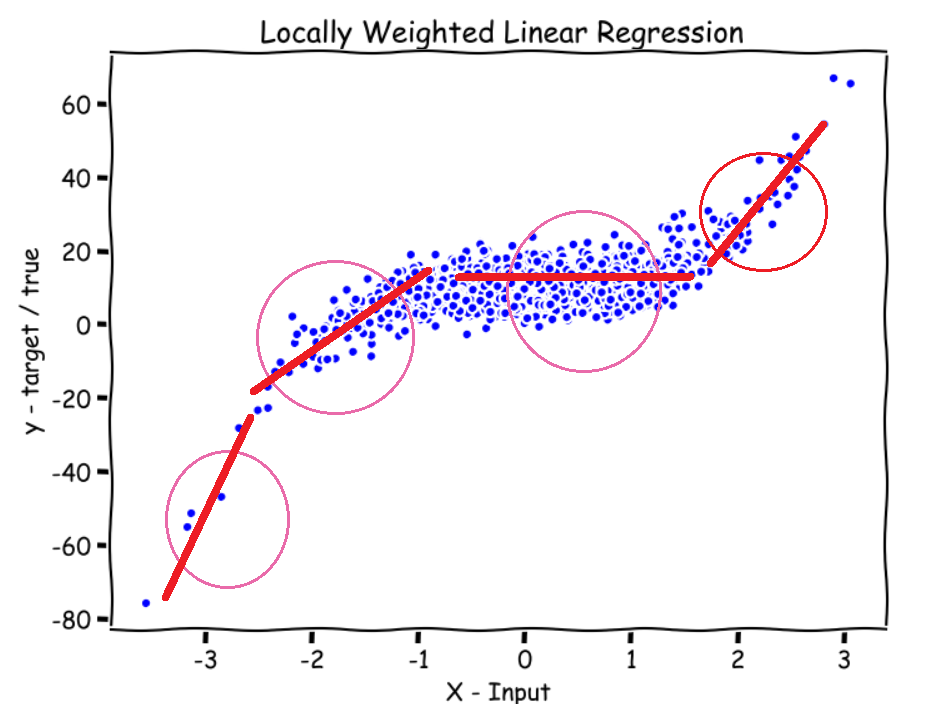
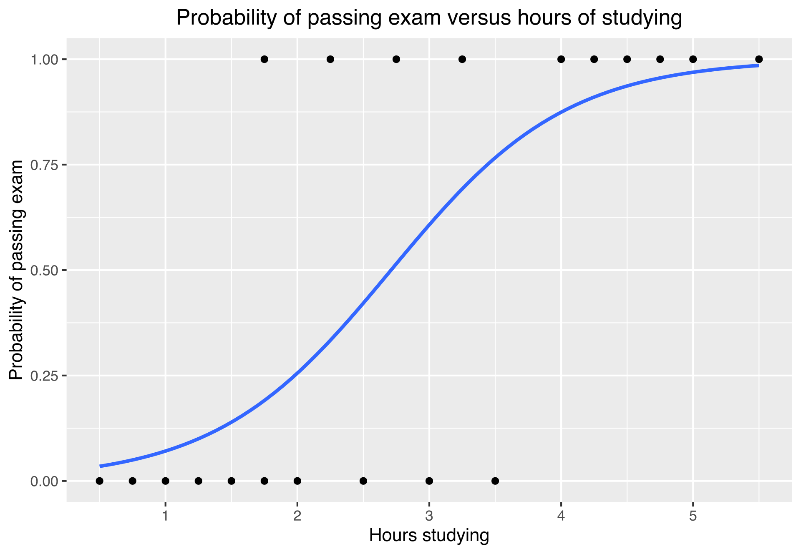

This is [lecture 3](https://www.youtube.com/watch?v=het9HFqo1TQ&list=PLoROMvodv4rMiGQp3WXShtMGgzqpfVfbU&index=3) of the Stanford CS229 course.

We go through
1. Locally weighted regression
2. Probabilistic interpretation
3. Logistic regression
4. Newton's method

# Recap of Notation

- $(x^{(i)}, y^{(i)})$ refers to the $i$-th example, where $x^{(i)} \in \mathbb{R}^{D + 1}, y^{(i)} \in \mathbb{R}$, and $x^{(0)} = 1$.
- $D$ is the number of features, $n$ is the number of examples
- Our hypothesis function is $h_\theta(\mathbf{x}) = \sum_{i = 0}^{n} \theta_j x_j = \theta^T \mathbf{x}$
- Our cost function is the squared error: $J(\theta) = \frac{1}{2} \sum_{i = 1}^{n} \left( h_\theta \left(\mathbf{x}^{(i)} \right) - y^{(i)} \right)^2$

# Locally Weighted Regression

1. Parameteric learning algorithm: Fix a fixed set of paramaters $\theta_i$ to the data.
2. Non-parameteric learning algorithm: Amount of data/parameters you need to keep grows linearly with the size of the training set.

To evaluate $h_\theta$ at a certain $\mathbf{x}$

| Linear Regression                                                                            | Locally-Weighted Linear Regression                                                                                                                                                                |
| -------------------------------------------------------------------------------------------- | ------------------------------------------------------------------------------------------------------------------------------------------------------------------------------------------------- |
| Fit $\theta$ to minimise $\frac{1}{2} \sum_{i} \left( y^{(i)} - \theta^T \mathbf{x} \right)$ | Fit $\theta$ to minimise $\sum_{i} w^{(i)} (y^{(i)} - \theta^T \mathbf{x}^{(i)})^2$, where $w^{(i)}$ is a weight function, usually $w^{(i)} = \exp\left(-\frac{(x^{(i)} - x)^2}{2 \tau^2}\right)$ |
| We do not need our input data anymore after calculating $\theta$                             | We still require all our input data for calculating new inputs                                                                                                                                    |

For locally weighted regression, to find the value for some input $\mathbf{x}$:
1. Find a neighborhood of points around $\mathbf{x}$
2. Fit $\theta$ to minimise

    $$
        \sum_{i = 1}^{n} w^{(i)} \left( y^{(i)} - \theta^T \mathbf{x}^{(i)} \right)^2
    $$

    where $w^{(i)}$ is a weight function

    $$
    w^{(i)} = \exp\left(-\frac{(x^{(i)} - x)^2}{2 \tau^2}\right)
    $$

    - If $|\mathbf{x^{(i)}} - \mathbf{x}|$ is small, then $w^{(i)} \approx 1$.
    - If $|\mathbf{x^{(i)}} - \mathbf{x}|$ is large, then $w^{(i)} \approx 0$.
    - This makes the algorithm focus on points close to $\mathbf{x}$, where $\tau$ (the **bandwidth**) determines how big the neighborhood should be (Larger values for $\tau$ means further points are weighted more).
    - If $\tau$ is too small, you may overfit the data. If $\tau$ is too large, you may over-smooth the data

# Probabilistic Interpretation for Linear Regression

Why least squares?

Assume that the real price of a house is:

$$
y^{(i)} = \theta^T \mathbf{x}^{(i)} + \epsilon^{(i)}
$$
- where $\epsilon$ is some random noise
- $\epsilon$ follows a normal distribution with mean 0 and variance $\sigma^2$. $\epsilon \sim \mathcal{N}(0, \sigma^2)$
  - We make this assumption due to [Central Limit Theorem](https://en.wikipedia.org/wiki/Central_limit_theorem).
- We also assume that $\epsilon$ is IID (independent and identically distributed). This means the error term for one house's price is independent of any other house's price.
- Do note that:
    $$
        P(\epsilon^{(i)}) = \frac{1}{\sigma\sqrt{2\pi}}\exp \left( -\frac{(\epsilon^{(i)})^2}{2 \sigma^2} \right)
    $$

The implies:

$$
P(y^{(i)} | x^{(i)}; \theta) = \frac{1}{\sigma \sqrt{2 \pi}} \exp \left( - \frac{(y^{(i)} - \theta^T \mathbf{x}^{(i)})^2}{2 \sigma^2} \right)
$$

I.e.

$$
y^{(i)} | x^{(i)}; \theta \sim \mathcal{N}(\theta^T \mathbf{x}^{(i)}, \sigma^2)
$$

The likelihood of $\theta$:

$$
\begin{align*}
\mathcal{L}(\theta) &= P(\vec{y} | \mathbf{x}; \theta) \\
&= \prod_{i = 1}^{N} P(y^{(i)} | \mathbf{x}^{(i)}; \theta) \\
&= \prod_{i = 1}^{n} \frac{1}{\sigma \sqrt{2 \pi}} \exp \left( - \frac{(y^{(i)} - \theta^T \mathbf{x}^{(i)})^2}{2 \sigma^2} \right)
\end{align*}
$$

We take the log-likelihood:

$$
\begin{align*}
 \mathcal{l}(\theta) &= \log \prod_{i = 1}^{n} \frac{1}{\sigma \sqrt{2 \pi}} \exp \left( - \frac{(y^{(i)} - \theta^T \mathbf{x}^{(i)})^2}{2 \sigma^2} \right) \\
 &= \sum_{i = 1}^{N} \left[ \log \frac{1}{\sigma \sqrt{2 \pi}} + \log \exp \left( - \frac{(y^{(i)} - \theta^T \mathbf{x}^{(i)})^2}{2 \sigma^2} \right) \right] \\
 &= -N \log(\sigma \sqrt{2\pi}) - \sum_{i = 1}^{N} \frac{(y^{(i)} - \theta^T \mathbf{x}^{(i)})^2}{2 \sigma^2} 
\end{align*}
$$

We want to choose $\theta$ to maximise $\mathcal{L}(\theta)$. We find the maximum likelihood estimate (MLE). 
- Since $\log$ is an increasing monotonic function, we can maximise $\mathcal{L}(\theta)$ by maximising $\mathcal{l}(\theta)$. 
- The first term in the equation is a constant, as $\theta$ is not in the term, so we can remove it from our calculations when maximising $\mathcal{l}(\theta)$.
- Since there is a negative sign in front of the sum, we should be minimising the following:
    $$
        \frac{1}{2} \sum_{i = 1}^{N} \frac{(y^{(i)} - \theta^T \mathbf{x}^{(i)})^2}{\sigma^2} 
    $$

Since $\sigma^2$ in the denominator is a constant, we can transform this to minimise:

$$
\frac{1}{2} \sum_{i = 1}^{N} \left( y^{(i)} - \theta^T \mathbf{x}^{(i)} \right)^2 = J(\theta)
$$

# Logistic Regression

Logistic regression is used in classification.

We now have a dataset $\{(\mathbf{x}^{(1)}, y^{(1)}), ..., (\mathbf{x}^{(N)}, y^{(N)})\}$ of $N$ points.
- $\mathbf{x}^{(i)} \in \mathbb{R}^{D}$
- $y \in \{ 0, 1 \}$ (Binary classification)

We want to find $h_\theta(\mathbf{x}) \in [0, 1]$.

We let:

$$
h_\theta(\mathbf{x}) = g(\theta^T \mathbf{x}) = \frac{1}{1 + e^{-\theta^T \mathbf{x}}}
$$

$g(z) = \frac{1}{1 + e^{-x}}$ is known as the **sigmoid/logistic** function.
- $g: \mathbb{R} \mapsto (0, 1)$

We want to find the value of $\theta$ such that:
$$
\begin{align*}
P(y = 1 | \mathbf{x}; \theta) &= h_\theta(\mathbf{x}) \\
P(y = 0 | \mathbf{x}; \theta) &= 1 -h_\theta(\mathbf{x})
\end{align*}
$$

These 2 equations can be combined to form:

$$
P(y | \mathbf{x}; \theta) = h_\theta(\mathbf{x})^y (1 - h_\theta(\mathbf{x}))^{1 - y}
$$

Using MLE:

$$
\begin{align*}
\mathcal{L}(\theta) &= P(\vec{y} | \mathbf{x}; \theta) \\
&= \prod_{i = 1}^{N} P(y^{(i)} | \mathbf{x}^{(i)}; \theta) \\
&= \prod_{i = 1}^{n} h_\theta \left(\mathbf{x}^{(i)} \right)^{y^{(i)}} \left(1 - h_\theta \left( \mathbf{x}^{(i)} \right) \right)^{1 - y^{(i)}}
\end{align*}
$$

We find the log-likelihood:

$$
\begin{align*}
\mathcal{l}(\theta) &= \log \mathcal{L}(\theta) \\
&= \sum_{i = 1}^{N} y^{(i)} \log h_\theta (\mathbf{x}^{(i)}) + (1 - y^{(i)}) \log (1 - h_\theta (\mathbf{x}^{(i)}))
\end{align*}
$$

We want to find $\theta$ to maximise $\mathcal{l}(\theta)$.

We can use **gradient ascent** to maximise $\mathcal{l}(\theta)$:

$$
\theta_j \coloneqq \theta_j + \alpha \frac{\partial}{\partial \theta_j} \mathcal{l}(\theta)
$$
- Gradient descent is used to minimise, gradient ascent is used to maximise
- In the previous linear regression version, we were minimising $J(\theta)$. In logistic regression, we are maximising $\mathcal{l}(\theta)$.

We will now differentiate $\mathcal{l}(\theta)$. Do note:

$$
\begin{align*}
g'(z) &= \frac{d}{dz} \frac{1}{1 + e^{-z}} \\
&= \frac{1}{(1 + e^{-z})^2} (e^{-z}) \\
&= \frac{1}{1 + e^{-z}} \left( 1 - \frac{1}{1 + e^{-z}} \right) \\
&= g(z) (1 - g(z))
\end{align*}
$$

To simplify the differentiation of $\mathcal{l}(\theta)$ with respect to $\theta_j$, we do it for a single training example $(\mathbf{x}, y)$:

$$
\mathcal{l}(\theta) = y \log h_\theta (\mathbf{x}) + (1 - y) \log (1 - h_\theta (\mathbf{x}))
$$

Now we differentiate:

$$
\begin{align*}
\frac{\partial}{\partial \theta_j} \mathcal{l}(\theta) 
&= \frac{\partial}{\partial \theta_j} y \log g(\theta^T \mathbf{x}) + \frac{\partial}{\partial \theta_j} (1 - y) \log(1 - g(\theta^T \mathbf{x})) \\
&= y \frac{1}{g(\theta^T \mathbf{x})} \left( \frac{\partial}{\partial \theta_j} g(\theta^T \mathbf{x}) \right) - (1 - y) \frac{1}{1 - g(\theta^T \mathbf{x})} \left( \frac{\partial}{\partial \theta_j} g(\theta^T \mathbf{x}) \right)  \\
&= \left( y \frac{1}{g(\theta^T \mathbf{x})} - (1 - y) \frac{1}{1 - g(\theta^T \mathbf{x})} \right) \frac{\partial}{\partial \theta_j} g(\theta^T \mathbf{x}) \\
&= \left( y \frac{1}{g(\theta^T \mathbf{x})} - (1 - y) \frac{1}{1 - g(\theta^T \mathbf{x})} \right) g(\theta^T \mathbf{x}) (1 - g(\theta^T \mathbf{x})) \frac{\partial}{\partial \theta_j} \theta^T \mathbf{x} \\
&= \left( y(1 - g(\theta^T \mathbf{x})) - (1 - y)g(\theta^T \mathbf{x}) \right) \mathbf{x}_j \\
&= (y - h_\theta(\mathbf{x})) \mathbf{x}_j
\end{align*}
$$

Hence, taking into account all the training examples, we can find:

$$
\frac{\partial}{\partial \theta_j} \mathcal{l}(\theta) = \sum_{i = 1}^{N} \left( y^{(i)} - h_\theta(\mathbf{x}^{(i)}) \right) \mathbf{x}_j^{(i)}
$$

We can find the final update rule:

$$
\theta_j \coloneqq \theta_j + \alpha \sum_{i = 1}^{N} (y^{(i)} - h_\theta (\mathbf{x}^{(i)})) \mathbf{x}^{(i)}_j
$$

> Note: This function looks identical to the Least Mean Squares update rule, but this is not the same algorithm, because now $h_\theta(x^{(i)})$ is a non-linear function of $\theta^T x^{(i)}$.

And similarly to the linear regression version, we can compact the update rule to update $\theta$:

$$
\mathbf{\theta} \coloneqq \mathbf{\theta} + \alpha \nabla_\mathbf{\theta} \mathcal{l}(\theta) = \mathbf{\theta} + \alpha \sum_{i = 1}^{N} \left( y^{(i)} - h_\mathbf{\theta} \left( \mathbf{x}^{(i)} \right) \right) \mathbf{x}^{(i)}
$$

## Derivation of Update Rule from Minimising the Cost Function

We can also try to minimise the cost function for logistic regression to find derive the update rule.

Let $l_\text{logistic}: \mathbb{R} \times \{0, 1\} \mapsto \mathbb{R}_{\geq 0}$ be the logistic loss, which we define as:

$$
l_\text{logistic}(t, y) \triangleq y \log(1 + \exp(-t)) + (1 - y) \log (1 + \exp(t))
$$
- $t$ is the prediction that we made with our hypothesis function $h_\theta(\mathbf{x})$.
- $y$ is the target value that we want to predict

We can see, by plugging in $h_\theta(\mathbf{x}) = 1 / (1 + e^{-\theta^T \mathbf{x}})$ into $-\mathcal{l}(\theta)$ (which is the negative log-likelihood):

$$
\begin{align*}
    -\mathcal{l}(\theta) &= - y \log h_\theta (\mathbf{x}) - (1 - y) \log (1 - h_\theta (\mathbf{x})) \\
    &= - y \log \left(\frac{1}{1 + e^{-\theta^T \mathbf{x}}} \right) - (1 - y) \log \left( 1 - \frac{1}{1 + e^{-\theta^T \mathbf{x}}} \right) \\
    &= - y \log \left(\frac{1}{1 + e^{-\theta^T \mathbf{x}}} \right) - (1 - y) \log \left( \frac{e^{- \theta^T \mathbf{x}}}{1 + e^{-\theta^T \mathbf{x}}} \right) \\
    &= y \log \left(1 + e^{-\theta^T \mathbf{x}} \right) - (1 - y) \log \left( \frac{e^{- \theta^T \mathbf{x}}}{1 + e^{-\theta^T \mathbf{x}}} \frac{e^{\theta^T \mathbf{x}}}{e^{\theta^T \mathbf{x}}} \right) \\
    &= y \log \left(1 + e^{-\theta^T \mathbf{x}} \right) - (1 - y) \log \left( \frac{1}{1 + e^{\theta^T \mathbf{x}}} \right) \\
    &= y \log \left(1 + e^{-\theta^T \mathbf{x}} \right) + (1 - y) \log \left( 1 + e^{\theta^T \mathbf{x}} \right) \\
    &= l_\text{logistic}(\theta^T \mathbf{x}, y)
\end{align*}
$$

Oftentimes, $\theta^{T} \mathbf{x}$, or $t$ is called the **logit**. Basic calculus gives us that:

$$
\begin{align*}
\frac{\partial}{\partial t} l_\text{logistic}(t, y) &= \frac{\partial}{\partial t} y \log(1 + \exp(-t)) + (1 - y) \log (1 + \exp(t)) \\
&= y \frac{-\exp(-t)}{1 + \exp(-t)} + (1 - y) \frac{1}{1 + \exp(-t)} \\
&= y \frac{-\exp(-t)}{1 + \exp(-t)} + \frac{1}{1 + \exp(-t)} - y \frac{1}{1 + \exp(-t)} \\
&= \frac{1}{1 + \exp(-t)} - y
\end{align*}
$$

Then by using chain rule:

$$
\begin{align*}
 \frac{\partial}{\partial \theta_j} \mathcal{l}(\theta) &= - \frac{\partial}{\partial t} l_\text{logistic}(t, y) \frac{\partial t}{\partial \theta_j} \\
 &= \left( y - \frac{1}{1 + \exp(-t)} \right) \mathbf{x}_j \\
 &= (y - h_\theta(\mathbf{x}))\mathbf{x}_j
\end{align*}
$$

which is consistent with the derivation for the gradient of the log likelihood.

> Note: The cost function for logistic regression is actually the negative log-likelihood: 
> $$
> \begin{align*}
> J(\theta) &= - \mathcal{l}(\theta) \\
> &= l_\text{logistic}(\theta^T \mathbf{x}, y) \\ 
> &= - y \log h_\theta (\mathbf{x}) - (1 - y) \log (1 - h_\theta (\mathbf{x}))
> \end{align*}
> $$

# Newton's Method

Allows you to take much bigger jumps to get towards the minima.
- [Newton's method in optimisation](https://en.wikipedia.org/wiki/Newton%27s_method_in_optimization)

Let's take a 1D problem to explain Newton's method. Suppose we have some function $f: \mathbb{R} \mapsto \mathbb{R}$. We want to find $\theta \in \mathbb{R}$ such that $f(\theta) = 0$.

> Recall we want to maximise $\mathcal{l}(\theta)$, i.e. we want to find $\mathcal{l}(\theta) = 0$.

Procedure for Newton's method
1. Find an initial guess for $\theta$, call it $\theta^{(0)}$.
2. We find a line $y = mx + b$ which is tangent to $f(\theta^{(0)})$.
3. We find at the value where this tangent line is 0 ($0 = mx + b$).
4. We use this newfound value for $\theta^{(1)}$.
5. We repeat step 2 - 4 until convergence.

Formally:

1. We start with an initial guess for $\theta$, denoted as $\theta^{(0)}$.
2. We repeat this step to find the next value of $\theta^{(i)}$, and we repeat until convergence:
    $$
    \theta^{(i + 1)} \coloneqq \theta^{(i)} - \frac{f(\theta^{(i)})}{f'(\theta^{(i)})}
    $$

So, in our logistic regression problem, we wanted to find the point where $\mathcal{l}'(\theta) = 0$. Substituting $f(\theta) = \mathcal{l}'(\theta)$:

$$
\theta^{(i + 1)} \coloneqq \theta^{(i)} - \frac{\mathcal{l}'(\theta^{(i)})}{\mathcal{l}''(\theta^{(i)})}
$$

The above definition is for when $\theta \in \mathbb{R}$. However, our $\theta$ is a vector. To generalise Newton's method for vectors, for some $\theta \in \mathbb{R}^d$:

$$
\theta^{(i + 1)} \coloneqq \theta^{(i)} + H^{-1} \nabla_\theta \mathcal{l}(\theta)
$$
- Recall that $\nabla_\theta \mathcal{l}(\theta) \in \mathbb{R}^{d}$
- $H \in \mathbb{R}^{d \times d}$ is the Hessian matrix. 

The Hessian $H$ is defined as a matrix of second-order partial derivatives:

$$
H_{ij} = \frac{\partial^2 \mathcal(l)}{\partial \theta_i \partial \theta_j}
$$

Newton's method enjoys a property called [**quadratic convergence**](https://math.stackexchange.com/questions/1735193/in-practice-what-does-it-mean-for-the-newtons-method-to-converge-quadratically) (the error shrinks quadratically from $\epsilon$ to $\epsilon^2$ in a single iteration), which means that Newton's method typically converges faster than batch gradient descent. However, one iteration using Newton's method can be more expensive that gradient descent (because you need to find the inverse of the hessian, which is very expensive for high-dimensional problems).

# Summary

In locally-weighted linear regression, we use the following cost function:

$$
\sum_{i = 1}^{n} w^{(i)} \left( y^{(i)} - \theta^T \mathbf{x}^{(i)} \right)^2
$$

where $w^{(i)}$ is a weight function

$$
w^{(i)} = \exp\left(-\frac{(x^{(i)} - x)^2}{2 \tau^2}\right)
$$

We give points near the input more weight, and points far away from the input less weight.

Logistic Regression is used for binary classification
- We have a dataset $\{(\mathbf{x}^{(1)}, y^{(1)}), ..., (\mathbf{x}^{(N)}, y^{(N)})\}$ of $N$ points.
  - $\mathbf{x}^{(i)} \in \mathbb{R}^{D}$
  - $y \in \{ 0, 1 \}$ (Binary classification)

In Logistic Regression, we use the hypothesis function:
$$
h_\theta(\mathbf{x}) = g(\theta^T \mathbf{x}) = \frac{1}{1 + e^{-\theta^T \mathbf{x}}}
$$

We use gradient ascent for logistic regression, because we are maximising the log-likelihood of $\theta$ given our dataset. We update the weights $\theta$ iteratively using the formula:

$$
\mathbf{\theta} \coloneqq \mathbf{\theta} + \alpha \nabla_\mathbf{\theta} \mathcal{l}(\theta) = \mathbf{\theta} + \alpha \sum_{i = 1}^{N} \left( y^{(i)} - h_\mathbf{\theta} \left( \mathbf{x}^{(i)} \right) \right) \mathbf{x}^{(i)}
$$

We can use Newton's method instead of gradient descent to more quickly converge to the minima/maxima. We do this by:

1. Starting with an initial guess for $\theta$, defined as $\theta^{(0)}$.
2. We calculate the next iteration's value of $\theta^{(i + 1)}$, using:
    $$
    \theta^{(i + 1)} \coloneqq \theta^{(i)} - \frac{\mathcal{l}'(\theta^{(i)})}{\mathcal{l}''(\theta^{(i)})} = \theta^{(i)} + H^{-1} \nabla_\theta \mathcal{l}(\theta)
    $$
3. We repeat until convergence.

Newton's method converges to the minima/maxima more quickly than gradient descent. However, for high-dimensional problems, Newton's method is more computationally expensive than gradient descent, because calculating $H^{-1}$ is expensive for high-dimensional data.

# Additional Resources

- [What Textbooks Don't Tell You About Curve Fitting](https://www.youtube.com/watch?v=q7seckj1hwM)